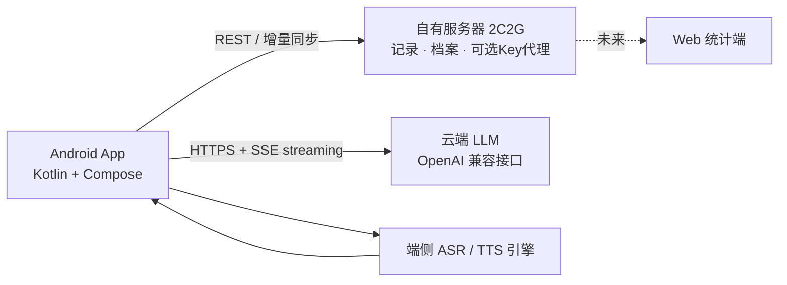

## 产品概述

一款个人自用的 Android 外语对话练习 App，以达成雅思总分 7.5（约 CEFR C1）为目标。通过「语音识别 ASR + 语音合成 TTS + 大语言模型 LLM」实现接近实时的英文口语对话练习、基础语法句式训练与按官方标准的多维评分反馈，并沉淀个人学习档案，支持自有服务器多设备同步。

## 核心功能

- 实时对话练习：与 AI 考官进行多轮英语口语对话，边说边显字，支持打断与话题引导，营造考场语伴氛围
- 基础语法句式练习：覆盖雅思高频语法点与句型（条件句、定语从句、虚拟语气、比较结构等）的口语化训练，补足语法广度短板
- 智能四维评分：按雅思口语评分标准（流利度与连贯性、词汇资源、语法广度与准确性、发音）给出分项分数、错误纠正与更优示范表达
- 录音与逐句回放：练习全程录音，支持回放对照 AI 逐句点评，训练自我纠音与复盘
- 错题本与学习档案：自动归集错句、弱项语法点、生词与评分趋势，形成个人薄弱项画像
- 话题与阶段体系：覆盖雅思高频话题库，按水平阶段编排从基础到冲刺的学习路径
- 端云协同：对话记录与学习档案同步至用户自有 2核2G 服务器，预留未来 Web 端统计

## 边界说明

- 本轮交付为完整设计方案文档（PRD、学习路径、功能规格、技术架构、后端设计、路线图），评审通过后再进入编码阶段
- 首要语言英语；架构预留后续扩展其他语言的抽象空间

## 技术栈选型

- 本轮交付方式：简体中文 Markdown 设计文档，存放于工作区 `docs/`；架构图统一用 Mermaid 代码块；不编写业务代码
- 文档主题产品技术栈（写入文档并在各章节保持一致）：
- Android：Kotlin + Jetpack Compose + Material 3，MVVM + Repository + Hilt，Room 本地库
- 语音：ASR / TTS 引擎抽象层（主选端侧方案，支持 partial results 实现边说边显字，含云 ASR 降级链路）
- LLM：OpenAI 兼容 Chat Completions 接口，baseUrl / model / Key 可配置，streaming 保障实时性
- 后端：适配 2核2G 的轻量服务（推荐 Go 或 NestJS + SQLite），提供 REST API、鉴权、增量同步与可选 Key 代理；不在服务器上跑大模型或自建 Whisper

## 实现思路

先构建"文档骨架 → 需求与学习路径 → 功能规格 → 技术架构 → 后端契约 → 路线图与全库校验"的逐层推导链，确保每份文档的术语、决策与数据契约前后一致；技术决策必须给出推荐理由与备选对比，需进一步核实的事实统一标注"待核实"而非臆造。

## 关键执行要点

- 版本事实：Android 17 = API 37（2026 年发布），compileSdk / targetSdk 37，Compose BOM 1.12.x 起支持 compileSdk 37；文档中给出 minSdk 26 至 28 的兼容权衡表
- 学习理论：评分模型严格对齐官方口语 band descriptors 四维（7 分特征如"灵活使用复杂结构、句法错误少"，8 分要求更严），设计文档需标注依据出处
- 一致性：跨文档建立统一术语表（模块名、实体名、API 命名），避免文档间口径漂移
- 边界清晰：安全边界区分"个人 Key 直接调用"与"服务器 Key 代理"两种模式；录音文件优先本地存储，服务器只存元数据，控制 2C2G 容量与带宽成本

## 架构设计

文档中需固化的产品系统上下文（作为 docs 各章架构图的总纲）：



## 目录结构（本轮产物）

```
Persondev/
├── README.md                        # [NEW] 项目总览、文档地图、评审阅读顺序
└── docs/
    ├── 01-prd.md                    # [NEW] PRD：目标用户、核心场景、功能清单、MVP 划分、非功能需求
    ├── 02-learning-path.md          # [NEW] 雅思7.5学习路径：能力模型、话题体系、分阶段路径、练习法理据
    ├── 03-feature-spec.md           # [NEW] 功能规格：实时对话、语法句式、录音回放、四维反馈、错题本交互与状态流
    ├── 04-android-architecture.md   # [NEW] Android 架构：MVVM/模块划分、ASR/TTS/LLM 抽象、Room、Android17 适配清单、权限
    ├── 05-backend-api.md            # [NEW] 后端设计：技术选型、REST 契约、ER 模型、鉴权、同步策略、Key 代理安全边界
    └── 06-roadmap-acceptance.md     # [NEW] 里程碑路线图、验收标准、风险清单与后续工程阶段计划
```

本设计方向将作为 03-feature-spec.md 中 UI/UX 章节的编写依据（原生 Jetpack Compose + Material 3，不引入 Web 组件库）。

整体采用"专注、可信、有活力"的学习工具视觉语言：浅色为主并内置深色模式，主色用深靛蓝至紫罗兰渐变传递专业与进阶感。语音练习主界面为全屏沉浸式：中央大尺寸按压式麦克风按钮，触发后伴随环形声波跳动动画；AI 与用户消息以不同气泡区分，AI 回复逐字流式呈现。四维评分以卡片 + 雷达图展示分项成绩与对比上次趋势。底部导航四项：对话、课程、档案、我的。交互强调：按压动效、流式文字、声波反馈、错误项点击即播示范句等微动效；页面以卡片分组，克制留白，适配手机与大屏（sw≥600dp）双形态。