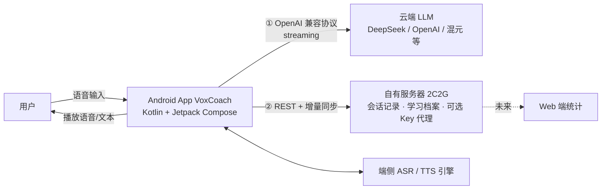

# Persondev · 雅思口语对话教练（IELTS Voice Coach）

> 开发代号：**VoxCoach**（最终产品名待定，本文档统一使用「雅思口语对话教练 / VoxCoach」指代）

一个**个人自用**的 Android 外语对话练习 App。以达成**雅思总分 7.5（≈ CEFR C1）** 为核心目标，通过 **ASR（语音识别）+ TTS（语音合成）+ LLM（大语言模型）** 的组合，实现：

- 接近实时的**英文口语对话练习**（模拟雅思口试三部分）
- **基础语法 / 常用句式**的口语化产出训练
- 按雅思官方评分标准（四维）的**智能评分与反馈**
- 录音回放、错题本与个人学习档案
- 端云同步（自有 2 核 2G 服务器，多设备 + 未来 Web 统计）

---

## 一、项目现状（重要）

- **当前阶段：MVP `1.0.0-mvp` 真机可验证收口**（P0 主路径 + 错题本 VB + 离线提示 SY-03 本地）。
- 设计文档（`docs/01`–`06`）已冻结；Android 多模块工程自 M1 起落地（见 `docs/06-roadmap-acceptance.md` §2）。
- 模块：`app` / `core:{domain,speech,llm,data,designsystem}` / `feature:{conversation,drill}`。
- 本地构建：`source /home/box/android-env.sh`（或自备 SDK）后执行 `./gradlew :app:assembleDebug`。
- **切勿提交** `local.properties`、API Key、keystore 或录音文件。
- **密钥安全（ST-01）**：LLM `apiKey` 仅经 **Android Keystore AES/GCM** 封装后落盘（ciphertext 在私有 SharedPreferences）；`baseUrl` / `model` 可明文存 DataStore。不使用已停维护的 `security-crypto` EncryptedSharedPreferences。升级后若设备上仍有旧版 DataStore 明文 `api_key`，会一次性迁入 Keystore 并清除明文。

### 当前可真机验证的 MVP 范围

- [x] 首次引导 + 麦克风权限门闸（onboarding / mic gate）
- [x] 设置 LLM（Base URL / Model / Keystore 加密 Key）
- [x] 自由对话 CV（按住说话 → ASR → LLM 流式 → TTS）+ 结束会话 EV 报告
- [x] Part 1 / Part 2 / Part 3 模拟口试 + 完整模考（结束后统一 EV）
- [x] 语法句式 GR（列表 → 产出判定 → 可收藏错题）
- [x] EV 报告回放本地录音 + 一键收藏错题（VB-01）
- [x] 错题本列表 / 详情（原文 · 修正 · 为什么 · 维度；可标记已掌握）（VB-02）
- [x] 档案今日统计 / 四维趋势（PF）
- [x] 网络/LLM 失败中文提示（断网、超时、401、429、5xx）；可结束会话并保留本地轮次与录音（SY-03 本地）
- [ ] 端云同步 / Key 代理（后期）
- [ ] 错题重练转 GR、语料收藏、Barge-in（P1+）

### 延迟冒烟（LatencySmoke）

M1 验收用固定 3 句英文走 MockAsr → MockLlm → MockTts，统计 ASR终稿→LLM首字→TTS起播：

1. **单元测试**：`./gradlew :core:domain:test`（含 `LatencySmokeTest` / `EvJsonParserTest`）
2. **应用内**：长按首页标题「VoxCoach 首页」进入调试页，点「运行 LatencySmoke」；报告写入 `files/smoke/latency-smoke-*.md`，并打 logcat tag `LatencySmoke`

### EV 标定回归（M2）

内置 8 条合成口语对话 + 人工半档标签（`core/domain` 资源 `ev_calibration/`，见 docs/04 §8、docs/06 M2）。离线路径：`FixtureBackedLlmClient` 注入固定 EV JSON → `EvJsonParser` → 逐维 `|Δ| ≤ 0.5`。

```bash
source /home/box/android-env.sh   # 或自备 SDK
./gradlew :core:domain:test --tests 'com.voxcoach.core.domain.ev.EvCalibrationTest'
# 或跑整个 domain 单测：
./gradlew :core:domain:test
```

可选 live 调试：构造 `EvCalibrationRunner(realLlm, config = Config(live = true))`（默认 `live=false`，单测勿开）。

---

## 二、文档地图

| # | 文档 | 内容 | 状态 |
|---|------|------|------|
| 1 | [`docs/01-prd.md`](docs/01-prd.md) | 产品需求文档：目标、场景、功能清单（含优先级）、MVP 边界、非功能需求 | ✅ 完成 |
| 2 | [`docs/02-learning-path.md`](docs/02-learning-path.md) | 雅思 7.5 学习路径设计：能力模型、话题体系、分阶段路径、练习法理据 | ✅ 完成 |
| 3 | [`docs/03-feature-spec.md`](docs/03-feature-spec.md) | 功能规格：实时对话、语法句式、录音回放、四维反馈、错题本的交互与状态流 | ✅ 完成 |
| 4 | [`docs/04-android-architecture.md`](docs/04-android-architecture.md) | Android 技术架构：模块划分、ASR/TTS/LLM 抽象层、本地存储、Android 17 适配 | ✅ 完成 |
| 5 | [`docs/05-backend-api.md`](docs/05-backend-api.md) | 后端与 API 契约：2C2G 选型、REST 契约、ER 模型、鉴权、同步策略 | ✅ 完成 |
| 6 | [`docs/06-roadmap-acceptance.md`](docs/06-roadmap-acceptance.md) | 里程碑路线图、验收标准、风险清单、评审结论 | ✅ 完成 |

> 推荐阅读顺序：`README` → `01` → `02` → `03` → `04` → `05` → `06`。

---

## 三、统一术语表（全库一致性基准）

各文档中所有模块名、实体名、缩写均以此表为准，避免口径漂移。

| 术语 / 缩写 | 全称 | 说明 |
|---|---|---|
| VoxCoach | — | 本产品开发代号（可替换） |
| **CV** | Conversation Practice | 对话练习模块 |
| **GR** | Grammar & Pattern Drills | 语法句式练习模块 |
| **EV** | Evaluation | 评分与反馈（会话后完整四维评测） |
| **HINT** | In-turn Realtime Hint | 轮内即时轻反馈（不打断流畅度） |
| **RP** | Replay | 录音回放与逐句复盘 |
| **VB** | Vault（错题本） | 错句/弱项归集，含 Vocabulary Note |
| **PF** | Profile / Statistics | 学习档案与数据统计 |
| **SY** | Sync | 端云同步 |
| Session | 练习会话 | 一次完整练习（对话或语法课），包含多轮 Turn |
| Turn | 轮次 | 会话内一次「用户说 → AI 回应」的最小单位 |
| Drill | 语法练习题 | 一次产出型语法句型练习任务 |
| Topic | 话题 | 雅思高频话题（如 Environment、Technology） |
| GrammarPoint | 语法点 | 雅思核心语法句式点（如第二条件句） |
| Stage | 学习阶段 | 能力路径的阶段性划分（S1–S4） |
| BandScore | 雅思单科分 | 0–9，步长 0.5 |
| FC / LR / GRA / P | 口语四维 | Fluency&Coherence / Lexical Resource / Grammatical Range&Accuracy / Pronunciation（官方维度缩写） |

**关键决策状态速览**（详细论证见对应文档）：

| 决策点 | 结论 | 出处 |
|---|---|---|
| 编译/目标 SDK | compileSdk 37（Android 17）/ targetSdk 37，minSdk 26 | 04 |
| UI 技术栈 | Kotlin + Jetpack Compose + Material 3 | 04 |
| LLM 接入 | OpenAI 兼容接口，直连为主 + 服务器代理为可选 | 04/05 |
| ASR 方案 | 抽象层多后端：系统 SpeechRecognizer 优先、ML Kit/云端降级 | 04 |
| 录音存储 | 本地优先，服务器仅存元数据 | 05 |
| 后端选型 | Go + SQLite（适配 2C2G） | 05 |
| 同步策略 | 时间戳 + 变更日志（oplog）增量同步 | 05 |

---

## 四、顶层系统上下文（架构总纲）



---

## 五、目录规划

```
Persondev/
├── README.md                        # 本文件：文档地图 + 术语表
├── .gitignore                       # 为后续 Android/Go 工程预置
└── docs/                            # 设计文档（当前阶段唯一产物）
    ├── 01-prd.md
    ├── 02-learning-path.md
    ├── 03-feature-spec.md
    ├── 04-android-architecture.md
    ├── 05-backend-api.md
    └── 06-roadmap-acceptance.md
```

> Android 端已按 `06` 里程碑落地；后端仍待 M3。
