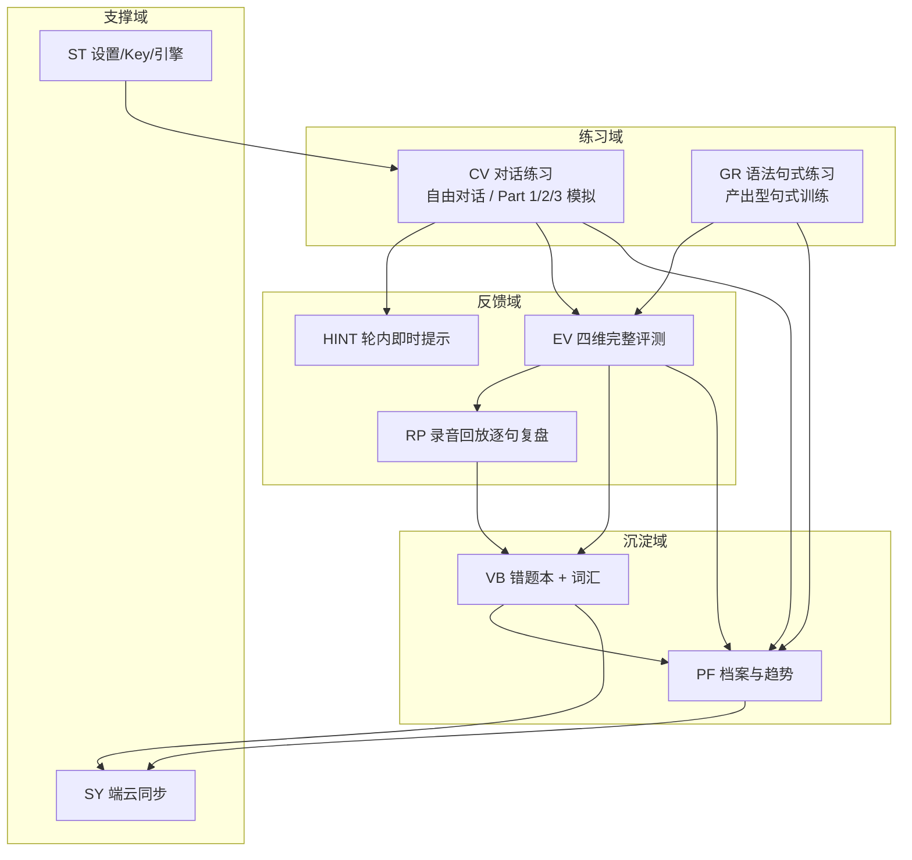

# 01 · 产品需求文档（PRD）

| 项目 | 内容 |
|---|---|
| 文档版本 | v0.9（设计评审稿） |
| 产品代号 | VoxCoach（雅思口语对话教练，正式名待定） |
| 平台 | Android（API 37 = Android 17，向下兼容，minSdk 26） |
| 目标语言 | 英语（架构预留多语种扩展） |
| 核心目标 | 帮助个人（作者本人）达成雅思总分 7.5（≈ CEFR C1） |

---

## 1. 背景与目标

### 1.1 背景

- 用户（即开发者本人）希望以英语为对象，通过「AI 语伴」实现高频、低成本、随时随地的口语输出训练，达到雅思总分 7.5 的水平。
- 雅思口语是四个单项中最依赖「真实对话输出」与「即时反馈」的科目：仅靠刷题/背模板难以提升，需要大量**有压力的口语产出** + **有针对性的纠错**。
- 大语言模型（LLM）已具备稳定扮演考官、按评分标准点评的能力；端侧 ASR/TTS 已能在普通 Android 设备上支撑接近实时的语音闭环。

### 1.2 目标

1. **功能目标**：交付一款可日常使用（非 Demo）的 Android App，覆盖「说（对话）— 练（句式）— 评（反馈）— 记（复盘）— 察（趋势）」完整学习闭环。
2. **学习目标**：帮助用户达到雅思总分 7.5。总分构成 = (L+R+W+S)/4，官方按 0.25/0.75 进位：平均分落在 **7.25 ≤ x < 7.75** 即得总分 7.5。因此四科需**均衡达标**，无短板科目。
3. **架构目标**：个人自用但可演进 —— 支持自有服务器多设备同步，预留 Web 统计，后端可运行在 2 核 2G 轻量服务器上。

### 1.3 非目标（本期明确不做）

| 非目标 | 原因 |
|---|---|
| 听力/阅读/写作的完整题库系统 | 本 App 聚焦「口语输出 + 语法句式」，其余科目靠真题与外部资源，仅做策略性统筹 |
| 大规模多用户 SaaS / 付费 | 个人自用；鉴权只保证「多设备 + 本人」 |
| 自建语音大模型 / 自托管 LLM | 2C2G 服务器无算力；走云端 OpenAI 兼容 API |
| 游戏化社交、排行榜、社区 | 与个人目标不符，避免分散精力 |
| iOS / 桌面端 | 本期仅 Android；技术选型（Compose、Room、KMP 潜力）为未来留口 |

---

## 2. 目标用户与使用场景

### 2.1 用户画像（单用户，但按能力分层设计）

| 属性 | 说明 |
|---|---|
| 身份 | 作者本人；备考雅思，目标总分 7.5（口语目标 7.0–7.5） |
| 当前水平 | 假设约雅思 6.0–6.5 / CEFR B2（待 App 内置「水平诊断」确认，见 02 文档） |
| 设备 | 主力 Android 手机（Android 8.0+，本设计按 minSdk 26 兼容） |
| 网络 | 家庭/办公 Wi-Fi 为主，移动网络兜底；存在断网 / 弱网通勤场景 |
| 时间预算 | 每天 20–40 分钟，零散练习为主 |

### 2.2 核心场景（用户故事）

| 编号 | 场景 | 描述 |
|---|---|---|
| U-1 | 每日 10 分钟热身对话 | 打开 App → 选话题 → 与 AI 考官自由对话 3–5 轮，边说边看到自己的转写文字 |
| U-2 | 模拟雅思口试 | 按 Part 1/2/3 完整流程走一遍（Part 2 有 1 分钟准备 + cue card 独白），结束后出四维报告 |
| U-3 | 薄弱语法句式专项 | 在「语法句式」里选弱项（如虚拟语气），对着提示口头产出 3–5 句，AI 判定结构是否用对并纠错 |
| U-4 | 复盘纠错 | 从错题本点开某个错句 → 听到自己当时的录音 → 对照正确示范句 → 再录一遍直到通过 |
| U-5 | 查看成长轨迹 | 看「档案」里的四维趋势雷达图与累计练习时长，决定下周练什么 |
| U-6 | 换设备续练 | 手机/平板登录后拉取最近会话与错题本，练习记录不丢失（SY） |

---

## 3. 功能需求总览

### 3.1 模块地图

### 3.2 功能需求清单（含优先级）

> 优先级：**P0** = MVP 必须有；**P1** = 二期（发布前应具备）；**P2** = 打磨/远期。

#### CV 对话练习

| ID | 需求 | 优先级 |
|---|---|---|
| CV-01 | 自由话题对话：选择 Topic 后开始多轮对话，AI 扮演 IELTS Examiner 按该话题推进 | P0 |
| CV-02 | 口试流程模拟：Part 1（问答）→ Part 2（cue card，1min 准备提示 + 1–2min 独白）→ Part 3（深度问答），完整计时 | P0 |
| CV-03 | 边说边显字：ASR 提供 partial results，用户说话时实时显示转写文字 | P0 |
| CV-04 | 打断（barge-in）：AI 语音（TTS）播放期间用户开口即停止播放并开始识别 | P1 |
| CV-05 | 话题引导与救场：用户卡壳时可选「提示」按钮，AI 给出追问/关键词；可设置 AI 耐心度（追问倾向） | P1 |
| CV-06 | 对话难度自适应：根据用户 Band 历史与当前话题调节 AI 词汇/句式复杂度 | P1 |
| CV-07 | 会话控制：开始/暂停/结束、剩余时间显示、轮数统计 | P0 |
| CV-08 | 结束后快捷「再说一遍」：对任一 Turn 立即重练并替换原 Turn | P2 |

#### GR 语法句式练习

| ID | 需求 | 优先级 |
|---|---|---|
| GR-01 | 语法点课程列表：按雅思高价值语法点/句式组织（见 02 文档的语法矩阵） | P0 |
| GR-02 | 产出型任务：给出句型骨架 + 话题提示，要求用户**口头**产出句子（非选择/填空） | P0 |
| GR-03 | 结构判定与纠错：ASR 转写后判定是否命中目标句式；语法错误就地给出「你的句子 → 修正 → 为什么」 | P0 |
| GR-04 | 句式转换练习：将简单句口头改写为目标结构（如 It's important to… → What matters is that…） | P1 |
| GR-05 | 影子跟读（Shadowing）：TTS 播标准句 → 用户跟读 → 发音/节奏评分 | P1 |
| GR-06 | 语法点掌握度追踪：每个 GrammarPoint 有掌握度，融入 PF 统计 | P1 |

#### EV 评分反馈

| ID | 需求 | 优先级 |
|---|---|---|
| EV-01 | 会话结束后四维评分（FC/LR/GRA/P），每维 BandScore 0–9 步长 0.5，附总评与目标差距 | P0 |
| EV-02 | 分项依据说明：给出每维打分的证据（例句引用） | P0 |
| EV-03 | 错误清单：按「语法/词汇/发音/连贯」分类列出问题项，含修正句与示范句 | P0 |
| EV-04 | 更优表达示范：对用户的平庸句给出 2 种更高分表达 | P0 |
| EV-05 | 逐句点评：按句段回放录音并播放 AI 对该句的点评（与 RP 联动） | P1 |
| EV-06 | 评分稳定性校准：内置「已标定样例评测」用于校准 Prompt（开发期工具） | P1 |
| EV-07 | HINT 轮内即时轻反馈：默认关闭；开启时每轮结束后 1 秒内给 1 条小提示，不打断节奏 | P1 |

#### RP 录音回放

| ID | 需求 | 优先级 |
|---|---|---|
| RP-01 | 会话全程录音，结束后按 Turn/句段回放 | P0 |
| RP-02 | 波形/分段时间轴显示，点击某句定位回放 | P1 |
| RP-03 | 0.75x/1x 慢速回放与句间暂停（A-B 复读区间） | P1 |
| RP-04 | 本地录音文件管理与空间提示（自动清理策略） | P1 |

#### VB 错题本与词汇

| ID | 需求 | 优先级 |
|---|---|---|
| VB-01 | 错误项自动入本：EV 产生的错误可一键收藏进错题本 | P0 |
| VB-02 | 错题详情：录音、错误类型、纠错、示范、关联 GrammarPoint | P0 |
| VB-03 | 错题重练模式：把错题转成 GR-02 式产出任务，复练至通过 | P1 |
| VB-04 | 词汇收藏：练习中 AI 标注的「高分表达/词组」一键收藏，支持发音与例句 | P1 |
| VB-05 | 复习提醒：轻量间隔复习（按错误时间与重练次数排序，不引入复杂 SRS 算法） | P2 |

#### PF 学习档案

| ID | 需求 | 优先级 |
|---|---|---|
| PF-01 | 每日练习量（时长/轮数/天数）与连续打卡 | P0 |
| PF-02 | 四维分数趋势（最近 N 次会话折线/雷达） | P0 |
| PF-03 | 弱项归因：自动统计错误类型分布 → 「本周重点练虚拟语气」等建议 | P1 |
| PF-04 | 与 7.5 目标差距的可视化（每维还差几档、需要补什么） | P1 |

#### ST 设置 / SY 同步

| ID | 需求 | 优先级 |
|---|---|---|
| ST-01 | LLM 配置：baseUrl / model / API Key（本机 Keystore 加密存储） | P0 |
| ST-02 | ASR / TTS 引擎选择与降级状态显示 | P1 |
| ST-03 | 服务器配置与同步开关 | P1 |
| SY-01 | 会话记录/评测/错题本/档案增量同步到自有服务器 | P1 |
| SY-02 | 多设备拉取与冲突处理（时间戳 + oplog，见 05 文档） | P1 |
| SY-03 | 离线可用：断网可练习（需本地 LLM 不可用时的说明），联网自动补传 | P0 |

---

## 4. MVP 边界（P0 集合）

**首个可日常使用的版本（v1.0 MVP）包含：**

1. 自由话题对话（CV-01/03/07）+ 会话全录音（RP-01）
2. 模拟口试 Part 1 流程（CV-02 的 P1 可作为 v1.1）
3. 基础语法句式练习：语法点列表 + 口头产出任务 + 结构判定纠错（GR-01/02/03）
4. 会话后四维评分报告（EV-01/02/03/04）
5. 错题本基础版（VB-01/02）+ 每日练习档案（PF-01）
6. LLM 直连配置（ST-01）+ 本地持久化（不依赖服务器的完整闭环）
7. 断网兜底提示与恢复（SY-03 的本地部分）

**MVP 不含**：云同步（P1）、barge-in、影子跟读、逐句点评（P1），这些进入 v1.1+。

---

## 5. 非功能需求

### 5.1 性能与实时性预算（对话体验核心指标）

| 指标 | 目标值 | 说明 |
|---|---|---|
| ASR 首字/首词延迟（边说边显字） | 首 partial ≤ 600ms | 依赖端侧引擎能力 |
| 说停到 ASR 最终结果的判定延迟 | ≤ 500ms（静音判定 400–800ms 可调） | 影响「轮次节奏」 |
| LLM 首 token 延迟 | ≤ 1.2s（直连优质端点） | 由流式 + 合理请求体控制 |
| 全句 TTS 起播延迟 | ≤ 300ms | 与 LLM 首段对齐后可边收边播 |
| 一轮完整往返（说→显字→LLM→TTS 开头） | 目标 2–4s，兜底 < 6s | 超预算时给出降级（先显字再播放） |
| 四维评测延迟（会话后） | ≤ 20s（一次约 10–20 Turn 的会话） | 可异步 + 进度提示 |
| App 冷启动 | ≤ 2s（中端机） | — |

> 以上为产品级预算，工程落地值与设备相关，在 04 文档给出分层降级策略。

### 5.2 兼容性

| 项 | 要求 |
|---|---|
| compileSdk / targetSdk | 37（Android 17） |
| minSdk | 26（Android 8.0）。覆盖 2026 年设备保有量的绝大多数（≥ ~97%） |
| 大屏 | targetSdk 37 后 Google Play 强制 sw≥600dp 自适应；App 按自适应布局设计（对话页支持双栏） |
| 机型差异 | 无 GMS（Google 服务）设备需有 ASR 降级路径（见 04 文档风险清单） |

### 5.3 可用性与可靠性

- 断网/弱网：对话练习（本地 LLM 不可用）时应明确告知并可「保存待练」；ASR 若为系统引擎，无网络用离线语言包，网络恢复后自动补传会话记录。
- 崩溃不丢数据：录音写盘 + 会话状态本地事务；App 被杀后重新进入可「恢复未完成会话」。
- 音频焦点：来电/其他 App 占用麦克风时自动暂停并恢复。

### 5.4 安全与隐私

- 个人 API Key：本机 **Android Keystore / EncryptedSharedPreferences** 存储，绝不明文落盘或写入日志。
- 录音与转写文本属**敏感个人数据**：默认仅存本地；上传服务器需用户明确开启同步，并走 HTTPS + 自签/自有证书说明。
- 自有服务器鉴权：每设备独立 API Key（见 05 文档），最小权限原则。
- 权限最小化：仅 `RECORD_AUDIO`、`POST_NOTIFICATIONS`（前台服务）、网络权限；Android 15+ 前台服务录音类型合规说明见 04 文档。

### 5.5 可维护性与可测试性

- 模块化、面向接口：ASR / TTS / LLM / 存储均为抽象层，可替换实现（接不同厂商）。
- 关键链路（转写→评测、评分→落库）支持注入 mock，便于自动化测试与「评分校准样例」回归。
- 埋点：仅本地记录关键性能指标（ASR/LLM/TTS 延迟分位），用于优化，不上传统计明细。

### 5.6 成本约束

| 项 | 约束 |
|---|---|
| 服务器 | 2 核 2G、按量带宽，只跑轻量后端与 SQLite |
| LLM API | 对话用小模型 + 评测用强模型的分层策略（见 04/05），控制 token 成本 |
| 录音 | 本地优先（估算：10min 会话 ≈ 6–8MB m4a），服务器不存音频 |
| 空间 | App 本地录音自动清理策略（默认保留最近 30 天 / 上限 500MB，可配） |

---

## 6. 里程碑概览

| 里程碑 | 内容 | 出口标准 |
|---|---|---|
| M0 | 设计评审定稿 | 本套文档冻结 |
| M1 | Android 工程骨架 + 单轮对话技术验证（ASR→LLM→TTS 通路） | 设备上能完成 3 轮稳定对话 |
| M2 | MVP 功能闭环（P0 全量） | 自测用例通过 + 可连续 7 天日常使用 |
| M3 | P1 功能（模拟口试、回放复盘、云同步等） | 完整学习闭环可用 |
| M4 | 上线打磨（大屏/深色/隐私合规/发布包） | 可安装正式版 |

详见 `docs/06-roadmap-acceptance.md`。

---

## 7. 风险摘要

| 风险 | 影响 | 缓解 |
|---|---|---|
| 无 GMS 设备上 ASR 不可用 | 核心对话无法识别 | ASR 抽象多后端 + 云端 ASR 备选；工程在真机先行验证 |
| ASR 转写错误导致评分失真 | 用户受误导 | 转写置信度展示、允许改字后再评分 |
| LLM 评分不稳定/偏宽 | 趋势不可信 | 内置官方样卷标定样例定期回归（EV-06） |
| 2C2G 服务器带宽/并发受限 | 同步慢 | 增量同步、不传音频、后端只做薄服务 |
| 个人时间投入不足导致项目烂尾 | 无法达成 7.5 | MVP 收敛 + 每次练习 ≤ 10 分钟的「够用优先」设计 |

---

## 8. 开放问题（待确认/待核实清单）

| # | 问题 | 影响 | 建议 |
|---|---|---|---|
| O-1 | 产品正式名称 | 仅命名 | 设计定稿时从候选名中选定 |
| O-2 | 服务器部署地（国内/境外） | 影响同步延迟与访问外部 LLM 的策略 | 若 LLM 走直连，服务器仅存数据，位置不敏感 |
| O-3 | LLM 主力厂商（DeepSeek / OpenAI / 混元…） | Key 配置与 Prompt 微调 | 先以 OpenAI 兼容协议抽象，定稿后确定默认 |
| O-4 | 模拟口试 Part 2 独白评分边界（是否按 cue card 分点打分） | 评分粒度 | 先按四维统一评分，分点打标为 P2 |

---

*本文档与 02–06 文档构成同一设计主体，术语以 README 术语表为准；本页涉及版本号（API 37 / minSdk 26）与 04 文档工程约束保持一致。*
