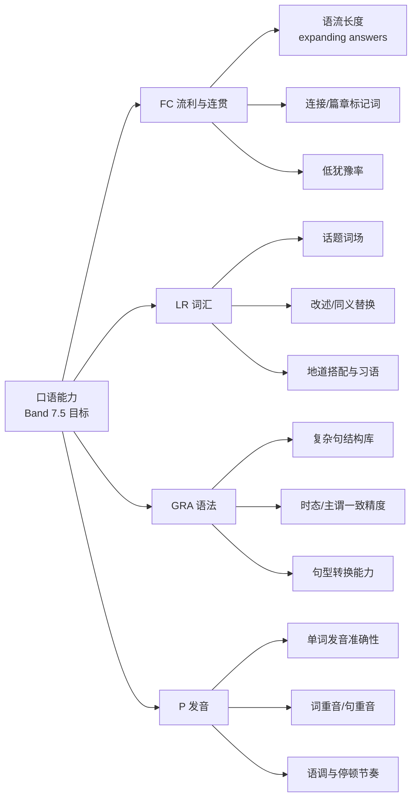

# 02 · 雅思 7.5 学习路径设计

| 项目 | 内容 |
|---|---|
| 文档版本 | v0.9 |
| 关联 | PRD §2 用户画像、§3.2 GR/PF；本页输出的 Topic / GrammarPoint / Stage 是 03 功能规格的数据依据 |
| 依据 | IELTS 官方《Speaking Band Descriptors (public version)》、《IELTS Guide for Teachers》公开信息；CEFR 对照表 |

> ⚠️ 本文给出的 7 分/8 分特征为对官方公开评分标准**要点的转述与工程化提炼**，用于设计评测 Rubric 与练习目标，不替代官方文档原文；开发评分 Prompt 时以官方原文逐条落地并内置标定样例（见 01 文档 EV-06 / O-4）。

---

## 1. 目标拆解：为什么是 7.5、需要什么

### 1.1 总分规则

雅思总分 = (听力 L + 阅读 R + 写作 W + 口语 S) / 4，四舍五入到 0.5（平均分 **≥7.25 且 <7.75** 进位为 7.5）。

### 1.2 各科目标组合（产品默认档位）

| 科目 | 默认目标 | 依据 |
|---|---|---|
| 听力 L | 7.5–8.0 | 对多数考生而言可用真题+精听拉分，成本最低 |
| 阅读 R | 7.5–8.0 | 同上 |
| 写作 W | 7.0 | 需要大量批改迭代，是个人时间投入的瓶颈 |
| 口语 S | **7.0–7.5** | 本 App 主攻对象；口语 7.5 意味着稳定在 Band 7 以上、逼近 Band 8 门槛 |

> **设计含义**：口语目标取 7.5 为「努力上限」，产品所有评分/练习的合格线默认按 **Band 7.5 标准**标注差距，同时避免把用户压向不切实际的 Band 8 词汇炫耀（Band 8+ 要求大量习语与精准措辞，边际成本高）。

### 1.3 口语四维与 Band 7 / Band 8 官方要点（工程化提炼）

| 维度（官方缩写） | Band 7 关键特征（转述要点） | Band 8 关键特征（转述要点） | → 我们对「7.5 达标」的操作定义 |
|---|---|---|---|
| **流利度与连贯性 FC** | 说得较长且自如；偶有犹豫/重复/自我纠正；灵活使用连接词 | 语速流畅、几乎无重复或自我纠正；围绕话题自然展开 | 单位语流长度（平均 ≥4–5 词/意群）、无长时间停顿、连词使用面 ≥ 8 类 |
| **词汇资源 LR** | 词汇面足够灵活；用一些不太常见词与习语；有效改述 | 自如使用广泛词汇；能精准表意；灵活改述 | Topic 词场覆盖率高；可自发性改述（paraphrase）；低频词≥1 个/分钟（量化提示，非硬指标） |
| **语法广度与准确性 GRA** | 较灵活地使用一系列复杂结构；多数句子无错 | 广泛使用复杂结构；绝大多数句子无错 | 复杂句式使用密度、结构多样性、错误率（错误/100 词 < 某阈值） |
| **发音 P** | 全程可听懂；整体可自然理解；偶有发音错误 | 全程易于听懂；语音特征（重音、语调）控制良好 | 元辅音错误率、词重音、句群节奏的听感评分 |

**评分原则（写入 EV 评测 Prompt）**：
1. 逐维 0–9 步长 0.5 打分；
2. 打分必须引用会话中的**具体证据句**；
3. 明显低于/高于相邻档时只允许 0.5 让步（Band 7 → 7.5 → 8 逐级锚定）。

---

## 2. 能力模型（把四维拆成可练习的子技能）

产品内的「弱点画像（PF-03）」与「错题本分类（VB）」都挂在这棵能力树下。

### 2.1 由能力树到练习形态的映射

| 子技能 | 主要练习形态（模块） | 评测落点 |
|---|---|---|
| FC1 / FC3 语流与低犹豫 | CV 自由对话、Part 2 独白 | 单位句长、停顿分布、改口次数（ASR 时间戳近似） |
| FC2 连接词 | GR 句式训练中的「篇章连接」组 + CV 反馈 | HINT 及时提示缺连接 |
| LR1 话题词场 | CV 按 Topic 展开 + VB 词场收藏 | EV 词场覆盖检查 |
| LR2 改述 | GR「句式转换/同义改述」任务 | 结构判定命中率 |
| GRA1 复杂句库 | GR 每个 GrammarPoint 的口头产出任务 | 目标结构命中率 + 准确率 |
| GRA2 精度 | EV 错误清单的 grammar 类别聚合 | 错误率趋势 |
| P1–P3 发音 | GR 影子跟读（GR-05）+ EV 发音维度 | P 维度分（ASR+规则辅助，见 04 文档局限说明） |

---

## 3. 语法句式矩阵（GRA 主攻对象，即 GR 课程数据源）

原则：**只练雅思口试中真正提分的高价值结构**，共分 6 组、20 个 GrammarPoint（MVP 先落 A/B/C/E 四组共 13 个，D/F 组于 v1.1 进入）。

| 组 | GrammarPoint | 口语使用场景示例 |
|---|---|---|
| A 条件与假设 | ① 第二条件句 ② 第三条件句（含混合） ③ unless / provided / as long as ④ wish / if only | 假设、后悔、谈判条件 |
| B 复杂修饰 | ⑤ 定语从句（who/which/whose…）⑥ 分词结构作状语 ⑦ 非限定定语从句插入 | 展开人物/经历描述 |
| C 从句包 | ⑧ 宾语从句与间接问句 ⑨ 主语从句（What matters is…）⑩ 让步从句（although, while…） | 观点表达 |
| D 比较与强调 | ⑪ 比较级与最高级的多样化 ⑫ 倍数/程度比较（far, by far）⑬ 强调句型 It is…that… ⑭ 倒装（Not only…, Hardly…） | 论证与情感强调 |
| E 时态精度 | ⑮ 过去完成/过去进行叙事 ⑯ 现在完成 vs 过去时 ⑰ 将来表达多种手段（will/be going to/about to/将来完成） | Part 2 叙事、计划 |
| F 语篇工具 | ⑱ 篇章连接词分层（firstly → moreover → conversely）⑲ 模糊限制语（I'd say, sort of, presumably）⑳ 改述标记（in other words, that is to say） | 全流程衔接 |

> MVP 范围：A 组 + B 组 + C 组 + E 组 = 13 个；D、F 组在 v1.1 进入。

---

## 4. 话题体系（LR + FC 的对象，即 CV Topic 数据源）

按雅思口语高频题库聚类为 **8 大主题域 × 每域 3–4 个具体话题**（Part 1/2/3 通用同一 Topic，练习时自动生成不同 Part 的题型）。同时给每个 Topic 预置「话题词场」种子词（LR1 练习输入）。

| 主题域 | 话题示例 | 高频词场种子（示例） |
|---|---|---|
| T1 个人与家庭 | Hometown, Family, Daily routine, Friends | upbringing, close-knit, commute… |
| T2 工作学习 | Studies, Career plans, Work-life balance | pursue, workload, deadline… |
| T3 科技与媒体 | Technology, Internet & social media, AI | automation, privacy, impact… |
| T4 环境与城市 | Environment, Transport, City life, Pollution | congestion, sustainable, eco-friendly… |
| T5 健康与生活方式 | Health, Diet, Sport, Sleep | sedentary, wellbeing, routine… |
| T6 社会与文化 | Culture, Traditions, Holidays, Gender roles | heritage, norms, contemporary… |
| T7 教育与成长 | Education, Learning, Childhood, Books | curriculum, milestone, exposure… |
| T8 抽象与展望 | Future, Dreams, Success, Aging, Choices | ambition, inevitable, perspective… |

设计要点：
- **难度锚点**：Topic 下挂「适用 Stage」，S1–S2 从 T1/T2/T5 起步，T8 抽象话题留给 S4。
- **闭环**：每个 Topic 对应一组 GR 推荐（如 T7 教育 → 必练 C/D 组句式），在 CV 选话题页推荐「先补句式再对话」。

---

## 5. 分阶段学习路径（Stage S1–S4）

### 5.1 阶段总览

| 阶段 | 名称 | 起止水平（口语） | 核心目标 | 每周建议量 |
|---|---|---|---|---|
| S0 | 水平诊断 | — | 定起点、定目标差距 | 1 次（App 内 Placement） |
| S1 | 打底 Flow | ≤6.0 → 6.5 | 敢说长、会说清（FC+基础 GRA） | 对话 3 次 + GR 2 次 |
| S2 | 结构升级 | 6.5 → 7.0 | 复杂结构主动化（GRA+LR 改述） | 对话 3 次 + GR 3 次 + 回放复盘 1 次 |
| S3 | 表达增厚 | 7.0 → 7.5 | 精准与地道（LR+FC 连贯） | 对话 4 次（含 1 次全真模拟）+ GR 2 次 |
| S4 | 冲刺稳定 | 7.5 → 稳定 7.5 | 全真模拟 + 弱项清零 | 全真模拟 2–3 次 + 弱项定向 |

### 5.2 阶段内容定义

**S0 水平诊断（约 10 分钟）**
- 流程：简版 Part 1（4 问）→ Part 2（1 题独白）→ Part 3（3 问）
- 输出：四维首评 + 建议起点阶段 + 推荐先练的 3 个 GrammarPoint + 3 个 Topic

**S1 打底 Flow（目标：从「蹦词」到「成段」）**
- 对话策略：AI 用短问、多追问；开启 HINT 连接词提示
- GR 重点：A① ②、B⑤⑥、E⑮⑯（能说对）
- 完成标志：平均每轮 ≥ 40 词；FC ≥ 6.5；GRA 错误率收敛

**S2 结构升级（目标：复杂结构「用得出、不出错」）**
- 对话策略：AI 提升提问抽象度，按 Topic 切换；要求用户每题答 3 句以上
- GR 重点：A③④、C⑧⑨⑩、E⑰（主动使用）
- 完成标志：Part 1 达标 7.0；单次会话使用 ≥ 4 种复杂结构且错误 < 3 处

**S3 表达增厚（目标：词汇精准 + 全篇连贯）**
- 对话策略：每周 ≥1 次全真 Part 1–3 模拟；AI 追问「你能换个说法吗」（LR2 改述压力测试）
- GR 重点：D⑪⑫⑬、F⑲⑳（高阶点缀）
- 词汇任务：每周围绕 1–2 个 Topic 精学词场，影子跟读 2 段
- 完成标志：LR、GRA ≥ 7.0；PR 弱项列表收敛到 ≤ 3 个固定音

**S4 冲刺稳定**
- 全部走全真模拟；错题本按弱项漏斗清零；每次模拟出差距报告（PF-04）
- 完成标志：连续 3 次模拟四维平均 ≥ 7.5 且无单维 < 7.0

### 5.3 Stage 的进/退级机制（产品自动化）

- 进级：当前 Stage 的「完成标志」连续 2 次会话满足 → 系统建议进入下一 Stage（用户确认）。
- 退级：新 Stage 连续 3 次会话四维均分低于上一 Stage 达标线 0.5 → 建议退回并生成补救 GR 单。
- Stage 变更只影响**推荐权重**（话题、GR、AI 难度、评测默认参照带），不锁死任何功能（用户可随时练任意内容）。

---

## 6. 练习形态背后的学习法理据（为什么这样设计）

| 设计 | 认知/语言学依据（要点） | 来源方向 |
|---|---|---|
| 以口语产出为核心，不搞选择题 | 二语习得中的「输出假说」：可理解输出迫使学习者注意形式（noticing the gap） | Swain (1985) 及后续综述 |
| 边说边显字（partial ASR） | 减少记忆负担，把注意力留给「组织内容与形式」。**当前实现**为松手后出转写（MiMo），词级 partial 仍为目标 | 认知负荷理论 (Sweller) |
| HINT 轮内即时提示 | 脚手架（scaffolding），在最近发展区 (ZPD) 内帮助达标，随后撤除 | Vygotsky 学派任务设计 |
| 复杂结构「提示→产出→判定→示范」 | 聚焦形式（focus on form）优于纯交际或纯语法讲解 | Long (1991) / Ellis |
| 录音回放 + 逐句复盘 | 自我监控与自我纠正需要「听见自己」，复盘优于只做新题 | 元认知训练研究 |
| 错题本 + 弱项定向重练 | 间隔暴露 + 针对性重练对语法习得有效；避免题海 | 间隔效应综述 |
| 全真模拟 + 四维评分 | 测试效应/刻意练习：明确目标、即时反馈、略超当前水平 | Ericsson 刻意练习 |
| 每会话 ≤10 分钟高频 | 动机保持与形成习惯，防止倦怠；口语进步靠频率而非单次时长 | 习惯养成/练习频率研究 |

> 工程含义：这些依据决定了**不要**为「题库量」而牺牲「每句话的反馈质量」——单次会话内的证据引用与纠错比题目数量更值钱（直接反映到 03 文档 EV 的数据结构与 04 文档 LLM 调用设计）。

---

## 7. 词汇与素材路线（支撑 LR）

- 词汇来源三层：① 话题词场种子（Topic 预置）② 会话中 AI 实时标记的高分表达 ③ 雅思真题语料中出现的高频表达（未来服务器端可增量补充词库，见 05 文档扩展位）。
- 每词条字段（VB-04）：词/搭配、语义、语境例句（来自用户自己的句子优先）、发音（TTS 播读）、来源会话。
- 词汇量目标参考：Band 7.5 常见研究中口语词汇量 ≥ 4000 词族量级；产品以「Topic 词场使用率」为可观测代理指标（每 Topic 5–8 个核心表达用出 ≥ 1 次）。

---

## 8. 学习路径在 App 里的呈现（导航落点）

| 入口 | 呈现 | 关联文档 |
|---|---|---|
| 首页「今日任务」 | 按 Stage 推荐 1 会话 + 1 GR + 可选复盘 | 03（首页） |
| 对话页 | Topic 选择 + 题型（自由/Part 1/2/3） | 03（CV） |
| 课程页 | 语法矩阵（6 组 26 点）与 Stage 推荐排序 | 03（GR） |
| 档案页 | Stage 进度环、四维趋势、差距报告 | 03（PF） |
| 我的 → 目标设置 | 各科目标（默认 S=7.5）；仅影响展示与提示 | 03（ST） |

---

*本页的 Topic / GrammarPoint / Stage 三个数据源结构将作为 03 功能规格与 04 数据模型（Room 表）的输入；版本与编号约定见 README 术语表。*
