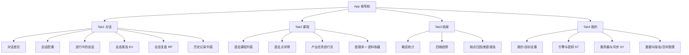
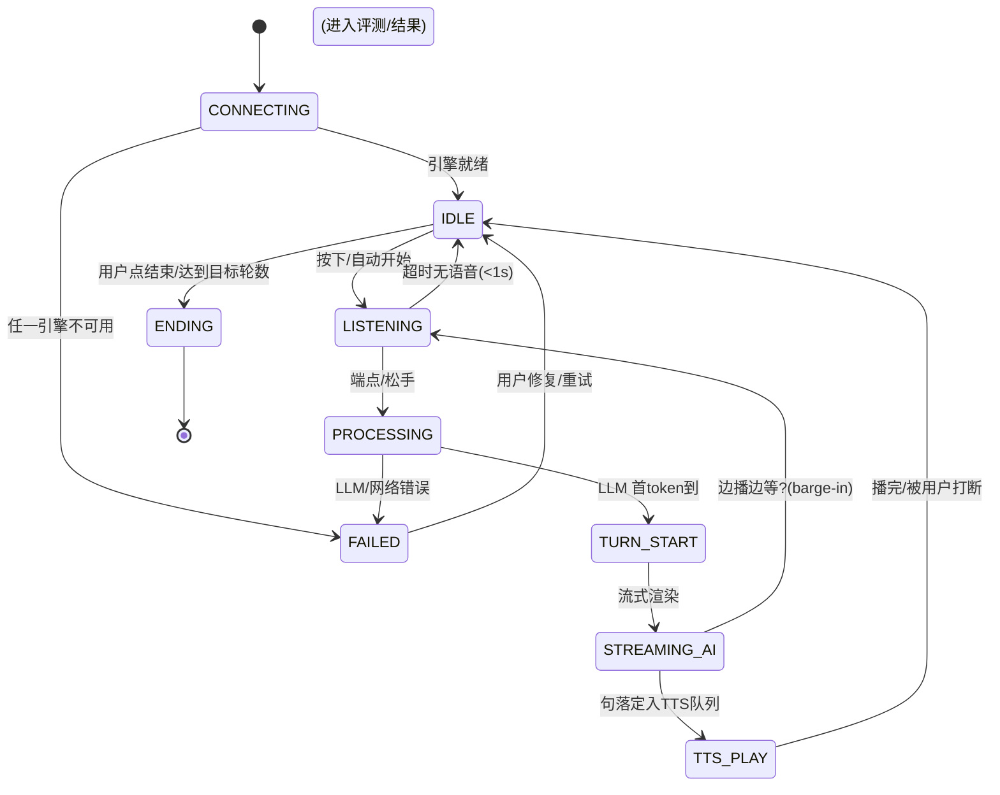
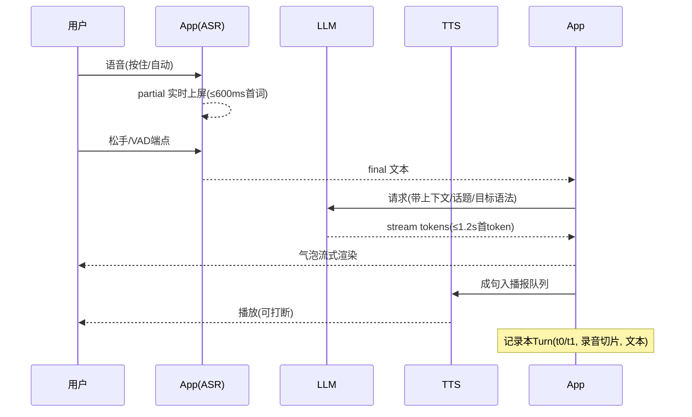
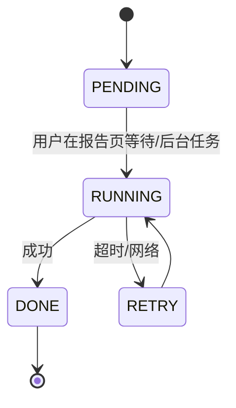

# 03 · 功能规格书（交互与状态流）

| 项目 | 内容 |
|---|---|
| 文档版本 | v0.9.2（首页改为 Figma 闯关岛学习地图；语音默认 MiMo-V2.5） |
| 关联 | PRD §3.2 功能清单（ID 引用）、02 学习路径（Stage/Topic/GrammarPoint 数据源）、04 技术实现、05 数据契约 |
| 范围 | 各模块的页面/交互/状态流与 UI/UX 设计规范（Material 3 视觉体系） |

> 读法：每个功能先讲「页面与交互」，再给「状态机 / 时序」，最后给「边界与异常」；界面字段的存储结构见 04/05。

---

## 1. 信息架构与导航

底部导航规格为 4 个 Tab（手机形态）；大屏（sw≥600dp）同构但支持双栏布局（见 §7）。

> **当前实现偏离**：MVP 底栏为 3 Tab——**学习地图**（原 Tab1 对话首页）/ **练习大厅**（GR）/ **个人中心**（档案+设置入口）。编码以 Figma `ielts-home` 为准。



**首启流程**（首次安装）：
`欢迎/引导页（3 屏：定位·隐私说明·用法） → 语言与目标设置（默认英语/总分7.5） → MiMo 配置引导（ST-01：Base URL + API Key，模型内置） → 设备权限引导（麦克风） → 建议先做 S0 诊断`

---

## 2. CV 对话练习

### 2.1 对话首页（Tab1 根页）

**当前实现（Figma `ielts-home` 学习地图）**：垂直闯关岛，替代下方「今日任务卡」布局。

| 岛 | 状态 | 点击 |
|---|---|---|
| 🎙 发音热身岛 | 已完成 + 进度 100% | 家乡话题自由对话 |
| 💬 话题素材岛 | 今天练 + 进度条 +「点击开始练习 →」 | Part 1 |
| 🧠 逻辑表达岛 | 待解锁 | 不可点（完成后进 GR） |
| 📝 全真模考岛 | 终极挑战 / 锁定 | 不可点（全解锁后进完整模考） |

顶栏：`SPEAKING MASTER` + 问候名 + 连胜胶囊。岛间为三点 + chevron 连接。长按问候区进 LatencySmoke。

**规格原稿（未按此实现，勿当成当前首页）**：

| 区块 | 内容 |
|---|---|
| 今日任务卡 | 按 Stage 推荐：「1 次 X 分钟对话」+「练 1 个语法点」+「复盘上次错句」（02 §8） |
| 快捷入口 | 大按钮：**自由对话**；次级：**模拟口试**（Part 1/Part 2/Part 3/完整流程 分段选择） |
| 最近会话 | 最近 5 条会话卡片（类型/话题/时长/时间/是否有评测），点击进 S3 或 S4 |
| 诊断入口 | 无任何评测记录时首屏置顶「做一次 10 分钟水平诊断」（S0） |

### 2.2 会话配置页 S1

- 模式选择（单选组）：自由对话 / P1 / P2 / P3 / 完整模拟
- Topic 选择（仅自由与 P3）：按 Stage 推荐排序（02 §4），可搜
- Part 2 专属：cue card 预置题型（人物/地点/物品/经历/观点五类随机或指定）
- 难度与 AI 行为：跟随 Stage 默认；高级选项：AI 追问频率（低/中/高）、是否开启 HINT
- 目标语法点（可选「本会话刻意练」）：从 GR 列表勾选 1 个，AI 会在该话题中制造使用机会
- 开始按钮：权限检查（麦克风/通知）→ 进入 S2

### 2.3 会话进行页 S2（核心体验）

#### 布局（手机全屏沉浸式）

```
┌──────────────────────────────┐
│ ←退出  会话标题(Topic·计时)   ● 录音中 │
├──────────────────────────────┤
│  AI 气泡：流式逐字渲染         │
│  · [Part 2 cue card 卡片区]   │ ← 独白时展示题目+剩余时间
│  用户气泡：转写区域             │
│  · 松手后识别（识别中 → final）│
│  · （评测后）纠错小卡 或 HINT │
├──────────────────────────────┤
│  (中央) 按压式麦克风按钮        │ ← 按住说话 / 点按切换“聆听”
│  环形声波跳动动画 = 识别中     │
│  「提示」按钮   「结束会话」    │
└──────────────────────────────┘
```

- AI 消息气泡左侧；用户气泡右侧。气泡内**回放小图标**：点按播放该句录音。
- 右上状态徽标：`聆听中… / 思考中… / AI 播放中… / 转写失败`。
- 结束后评分生成时进入「生成报告中…」过渡页，完成后跳 S3。

#### 关键交互
1. **按住说话（当前实现）**：按下开始采集麦克风 PCM；松开 = 本轮说完，把该段 WAV 发给 MiMo ASR，气泡先显示「正在识别…」再替换为转写。另提供**点击切换「聆听模式」+ VAD**（P1，未实现）。
2. **转写上屏**：当前无说话中的词级 partial（系统 SpeechRecognizer 时代的 CV-03 目标仍保留）。误识可点「改」编辑该句文字（编辑后的文本作为入 LLM 的输入）。
3. **打断 barge-in**：AI 正在 TTS 播报时用户按下麦克风 → 立即停止 TTS 与 LLM 尾巴，进入聆听，并把「打断点」计入会话元数据（复盘可见）。
4. **卡壳救场**：「提示」→ 轻量请求 AI 给一个追问或 2–3 个关键词（1 行内），不打断本 Turn 记录。
5. **结束会话**：确认对话框（剩余轮数不足提示）→ 进入评测流程（若为 Drill 型则直接出 GR 结果）。

#### 会话状态机



- 超时/异常统一进 `FAILED`，页面不退出，给「重试 / 降级」（04 文档策略）。
- Part 2 独白在 TURN_START 前插入「1 分钟准备倒计时」子状态；独白结束由用户点「说完了」或静音判定触发。

#### 一句话时序（正常一轮）



### 2.4 边界与异常

| 场景 | 行为 |
|---|---|
| 麦克风权限拒绝 | 弹设置引导；允许在无录音的「纯文本模式」下先跑通 LLM |
| ASR 无 GMS/离线包缺失 | 提示装语言包或切云端 ASR（见 04） |
| LLM 断网/超时 | 保留已说话轮，气泡提示，允许「本机存草稿，稍后继续」 |
| TTS 引擎异常 | 降级为仅文字回复 |
| 来电/音频焦点被抢占 | 暂停会话与录音，恢复后继续（录音分段保存防丢） |
| 进程被杀 | 下次启动提示恢复未完成会话（音频已在盘、转写落库） |

---

## 3. GR 语法句式练习

### 3.1 课程列表 G0（Tab2 根页）

- 顶部 tab 分段：**语法句式 / 错题本 / 语料收藏**（VB 见 §6）。
- 语法句式：按 02 §3 的 6 组呈现，每组卡片显示包含的 GrammarPoint、当前掌握度（进度条）。
- GrammarPoint 卡片 = 点/例句预览 + 掌握度 + 「推荐练」（按 Stage）。

### 3.2 语法点详情 G1

- 规则速览（1 屏内 2–3 条 + 1 组对比例句）
- 「先听后说」示范句：TTS 播标准句，可逐句跟读
- 「开始口头产出」主按钮 → G2；附「在对话中刻意练」跳到 S1 配置

### 3.3 产出任务进行页 G2（GR-02/03 核心）

- 顶部：目标 GrammarPoint 与判定规则说明（如「请使用 If I had…, I would…」）
- 任务卡（一次显示 1 题）：句型骨架 + 话题提示（例：*「谈一个你后悔的决定」——用第三条件句说 2 句）*。题目来自「本地模板 × 话题池」，可由 LLM 现生成变体（v1.1+）。
- 交互：复用 S2 的按住说话组件（**单句级**：说一句 → 出结果 → 下一句）。
- 单句结果反馈（**每句即时判定**）：
  - ✅ 命中目标结构且无错 → 绿色通过卡 + 鼓励
  - ⚠️ 结构用错/未用（ASR 转写后由 LLM 判定）→ 红卡：`你的句子 → 修正句 → 为什么(≤2行)`；该句进错题本候选（自动收集，可撤销）
  - 🎧 回听自己这句 → 再试（原地重说，不增加题数）
- 每题 2 次机会；第 2 次仍不过 → 显示示范句并要求跟读一遍作为「通过」。
- 结束页：本课正确率、各句判定列表、掌握度增量（PF-06）。

### 3.4 状态与异常

- 与 S2 共用语音状态机，但为**单句短流程**：LISTENING → ASR final → 本地「结构命中预判」(正则/规则粗筛，可空) → LLM 判定 → 反馈卡。
- 规则粗筛可离线秒回，减少 LLM 调用次数（成本与速度），仅当粗筛通过/边界情形才叫 LLM。
- 单句反馈 LLM 调用预算：≤ 400 token/句；失败时可「跳过此题」，不阻塞。

---

## 4. EV 四维评测与会话报告

### 4.1 报告页 S3（会话后）

```
┌──────────────────────────────┐
│ 总分 Band X.X（较上次 +0.5）    │
│ [四维雷达图]                    │
│  FC 6.5 │ LR 7.0 │ GRA 7.0 │ P 7.5  │ ← 四张分项卡
│  · 每卡: 证据引用(1句)          │
│  · 目标差: “GRA 距 7.5 还差0.5” │
├──────────────────────────────┤
│ 错误清单（按 FC/LR/GRA/P 分组）  │
│  · 每条: 你→修正→为何→示范      │
│  · 播放该句录音 / 收藏进错题本    │
│ 高分亮点（AI 圈出的好句）         │
│ 更优表达示范（2 个改写）          │
├──────────────────────────────┤
│ [去复盘] [保存到错题本(可选全部)] │
└──────────────────────────────┘
```

### 4.2 评测请求内容（EV-01/02/03/04）

一次评测 = 一次 LLM 调用（强模型），输入：
1. 会话完整转写（含角色、Turn、时间戳）+ 任务上下文（话题/Part/目标语法）
2. 四维 Rubric（02 §1.3 的操作定义 + 官方要点）
3. 结构化输出要求（JSON Schema 约束，见 04/05 契约）

输出（EVResult）字段（简版，正式 Schema 见 05 §4.4）：
`overallBand, dims{fc,lr,gra,p}{score,evidence[],comment}, items[]（含 dimension/category/quote/correction/why/model[], tRange), highlights[], alternatives[], goalGap{dim,deficit}`

### 4.3 评测状态与异常


- 长会话可后台评测（离开页面继续跑，完成通知）；失败可「稍后重试」，不丢会话本体。
- 评测前允许用户编辑/删除个别误识句，**编辑后重新生成才入库**（防「冤枉」用户）。

### 4.4 HINT 轮内即时轻反馈（EV-07，默认关）

- 仅当配置开启：每 Turn 结束后 0.8s 内浮现 1 条小卡（连接词缺失 / 时态跑偏 / 换词建议），10s 自动消失，可点击展开详情并入错题本。
- 成本控制：HINT 与对话共用同一流式响应中的一个 `hint` 字段，不额外调用。

---

## 5. RP 录音回放与逐句复盘

### 5.1 复盘页 S4

- 顶部：整段播放 / 0.75x / A-B 复读区
- 中部：**句段时间轴**（波形条 + Turn 标记）；拖动定位到某句
- 逐句区（与 EV 错误清单联动）：点某句 → 播放该句 + 展示该句 EV 点评/判定
- 底部动作：`加入错题本` `删掉这句`（改 ASR 误识，触发重新评测提示）`导出音频`

### 5.2 对齐规则（重要工程约束）

- 当前 MiMo ASR 不提供词级时间戳 → 以 **Turn/句段级** 对齐（松手/「说完了」时刻 + 录音本地 `elapsedMs`）。词级时间戳若厂商后续提供则为增强项。
- EV 错误项的 tRange 映射到句段索引；无词级时间戳时高亮整个句段。

### 5.3 录音管理

- 会话录音 = 单一 **wav**（16 kHz PCM16LE mono）+ 句段索引表（Room，本地）。文件在 `files/recordings/<sessionId>.wav`，不上传自有同步服务器。
- 空间策略（PRD 5.6）：默认保留 30 天 / 500MB，报告页与「我的→空间管理」可手动逐条清理或导出（本地分享）。

---

## 6. VB 错题本与语料收藏

### 6.1 错题本（Tab2 → 错题本）

- 列表：按 错误维度(FC/LR/GRA/P) 筛选 + 关键词搜 + 来源会话跳转
- 错题卡：`原文(灰) → 修正(绿) `、错误类型 chip、关联 GrammarPoint
- 详情页：错题完整信息 + 录音回放 + **「重练这道题」**（转 GR 单句任务，练过通过后自动移入「已掌握」折叠区，可回滚）
- 批量操作：勾选 → 重练 / 导出 / 删除
- 「已掌握」判定：重练通过 1 次 + 后续会话中同类错误未再犯（由 PF 弱项统计判定）

### 6.2 语料收藏（词汇/高分表达，VB-04）

- 词条 = 词/搭配 + 语义 + **语境例句（优先用户原句）** + 发音按钮 + 来源会话 + 收藏时间
- 分组：按 Topic 词场 / 按来源会话 / 全部
- 批量复习模式：列表卡片流 + 发音跟读（简易，v1.1）

---

## 7. UI/UX 设计规范（Material 3 视觉体系）

> 视觉语言定位：**专注、可信、有活力** —— 让用户感到「这是一件正经的备考工具，同时充满反馈的愉悦感」。

### 7.1 主题令牌（Token，映射 Material 3）

| 令牌 | 浅色值 | 深色值 | 用途 |
|---|---|---|---|
| Primary | `#FF5A5F`（珊瑚） | `#FF5A5F` | 当前岛、主操作、选中 Tab |
| Secondary / Accent | `#B8E649`（柠绿） | 同左 | 次强调 |
| Success | `#4CB974` | 同左 | 已完成岛、进度满 |
| Background | `#FAF6F2` | `#0F1220` | 页面底 |
| Surface | `#FFFFFF` | `#161B2E` | 岛信息卡 |
| OnSurface | `#2D211F` | `#FFFFFF` | 主文本 |
| OnSurfaceVariant | `#8A7D7A` | `#B6BDD0` | 次级文本 |
| Locked / Gold | `#A59B98` / `#B8962E` | 同左微调 | 待解锁岛 / 终极挑战 |
| Error / Warning | `#B00020` `#F59E0B` | 同左 | 判定/提示 |

> 令牌以 `core/designsystem/.../Color.kt` 与 Figma `ielts-home` 为准。

### 7.2 字体

- 字体族 Roboto（Material 默认，中文回退系统字体）；数字用等宽特征便于分数阅读。
- 字阶：Display 32sp/Bold → 大标题 26sp/700 → 标题 18sp/600 → 正文 15sp/400 → 辅助 13sp。口语内容气泡正文 ≥ 15sp。

### 7.3 核心组件与动效规范

| 组件 | 规范 |
|---|---|
| 麦克风主按钮 | 直径 ≥ 72dp；按压缩放 0.92 + 阴影加深；录音时外圈**声波环形跳动动画**（振幅随 RMS 实时） |
| 语音气泡 | 圆角 18dp；AI 左（SurfaceContainer）、用户右（Primary 容器白字）；**AI 文字逐字/逐词淡入流式**（≤ 60 token/s 视觉节奏） |
| 判定卡片 | 通过 = 左绿条；错误 = 左红条 + 「修正句」等宽底纹；动画：卡片入场上滑 120ms + 淡入 |
| 雷达图/趋势 | 报告页雷达图补间动画 400ms；PF 趋势线用平滑曲线 + 末端点呼吸效果 |
| 底部导航 | 当前 3 tab（学习地图 / 练习大厅 / 个人中心），图标 + 文字，选中态 Primary |
| 按压反馈 | 所有可点卡片 ripple + 0.1s 缩放；TTS 播放中对应气泡呼吸高亮 |
| 深色模式 | 跟随系统 + 手动三态；渐变与主色在深色降低亮度保持对比 ≥ 4.5:1 |

### 7.4 页面模式与无障碍

- 大屏 sw≥600dp：S2 双栏（左：对话流；右：cue card/目标语法/提示面板）；S3 双栏（左：报告；右：时间轴）。以 `WindowSizeClass` 驱动。
- 无障碍：所有状态（录音中/思考中）有 TalkBack 播报；触控目标 ≥ 48dp；语音反馈开关「播报转写结果」可选；颜色不作唯一信息通道（错误同时有图标与文字）。
- 权限引导文案：说明「会话录音保存在本机；按住说话的识别片段会发往你配置的 MiMo ASR」。

---

## 8. 数据所有权与可见性（贯穿全模块）

- 所有练习记录、评分、错题、收藏**默认本地生成、本地可见**；自有云同步为**显式开启**（SY，见 05）。会话 wav 不离开本机；识别音频与 TTS 文本会发往用户配置的 MiMo（见 README 团队约定）。
- 删除语义：本地点删除 → 同步墓碑（tombstone）到服务器；「清除全部学习数据」二次确认 + 可先导出。
- 每次 EV/GR 判定都带 `engineVersion/promptVersion`，保证「同一错误今天与三个月前的判定口径可比」。

---

*本规格中所有出现在交互/字段命名中的实体（Session/Turn/EVResult/FeedbackItem/VocabNote…）在 04（Room 表）与 05（REST Schema）中给出正式结构；三份文档必须保持一致。*
