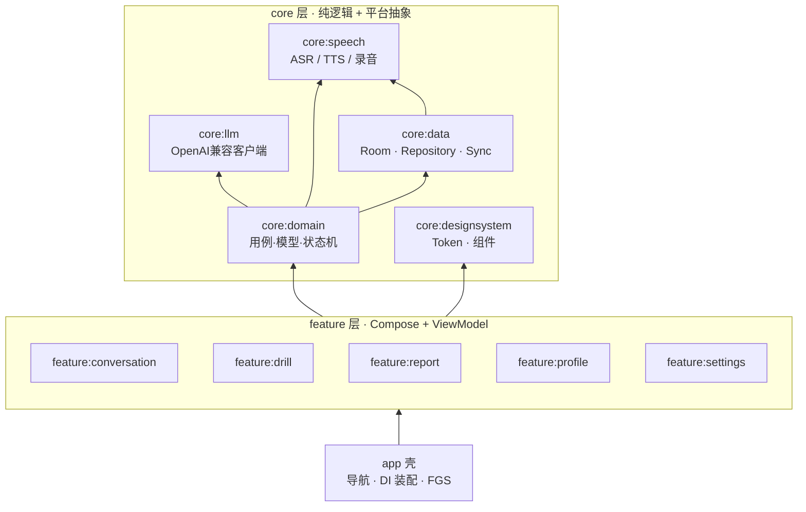
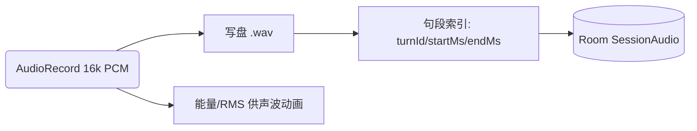
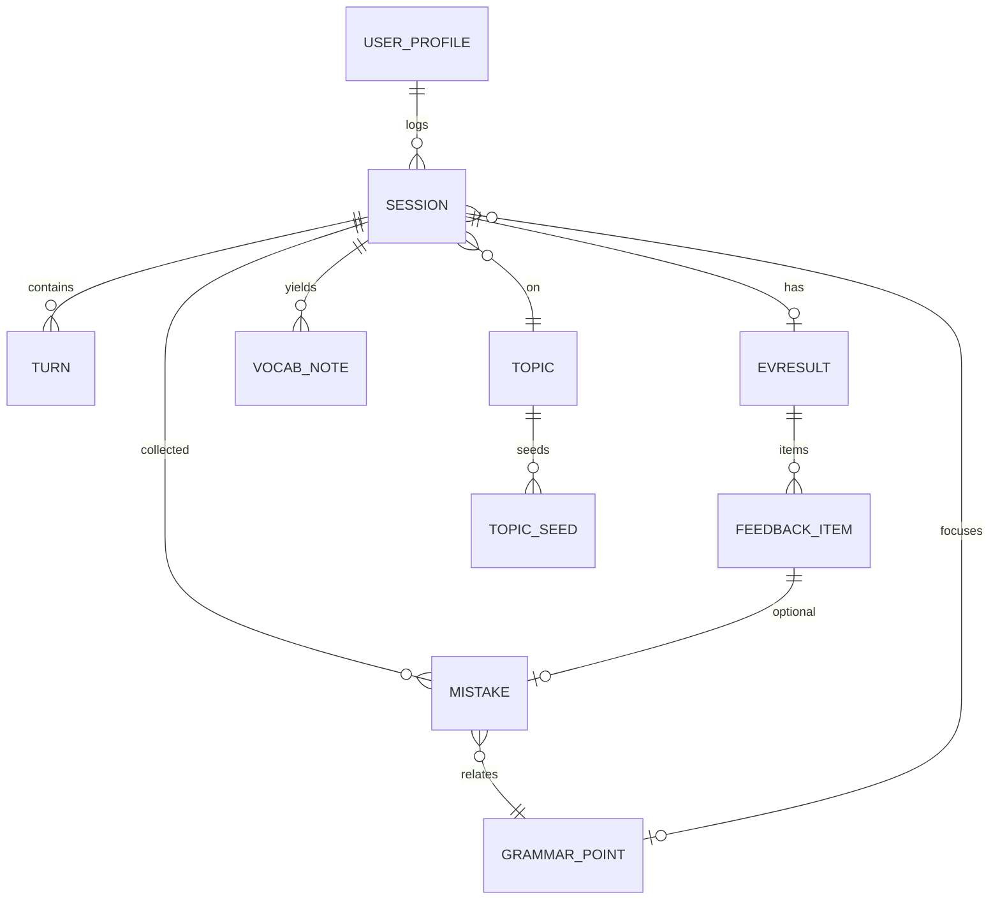

# 04 · Android 技术架构

| 项目 | 内容 |
|---|---|
| 文档版本 | v0.9.3（闯关岛插画标 + 环形进度；默认引擎 MiMo-V2.5） |
| 关联 | 03 功能规格（页面与状态机在此落地）、05 后端契约（同步与评测代理）、README 术语表 |
| 工程基线 | Kotlin + Jetpack Compose + Material 3；compileSdk 37 / targetSdk 37 / minSdk 26 |

---

## 1. 兼容性与版本策略

### 1.1 SDK 基线决策

| 项 | 取值 | 理由 |
|---|---|---|
| compileSdk | 37（Android 17） | 使用最新平台 API；Compose 1.12+ 已支持 compileSdk 37（官方 BOM 说明） |
| targetSdk | 37 | 满足 Android 17 行为变更要求；首版即按最新规范适配（大屏自适应等） |
| minSdk | **26**（Android 8.0） | 权衡见下 |

**minSdk 权衡表**（2026-09 视角）：

| minSdk | 覆盖（约） | 支持 | 代价 |
|---|---|---|---|
| 23 | ~99%+ | ML Kit 硬性下限 | 需兼容旧权限/后台行为；Edge-to-edge、图标适配旧设备成本高 |
| **26（推荐）** | ~97%+ | 8.0+ 通知渠道、后台限制模型稳定；各库最低要求主流在此以上 | 放弃极少老旧设备（个人设备不受影响） |
| 28 | ~94% | 更干净的 API 面 | 覆盖损失 3%，个人场景无收益 |

> 若日后上架 Google Play，可按商店要求把 minSdk 提到更高；个人侧载优先则以「自己设备 + 一台备用测试机」为真实验证基线。

### 1.2 工具链版本（工程初始化时冻结并核对）

| 组件 | 基线建议 | 备注 |
|---|---|---|
| Android Studio | 最新稳定（2026-09） | 用其内置 AGP 默认 |
| AGP | 随 Studio 默认（8.1x 世代） | 支持 compileSdk 37 |
| Kotlin | 2.x + Compose Compiler Gradle Plugin | 与 Compose 匹配 |
| Compose BOM | 支持 compileSdk 37 的最新稳定 BOM | 官方 2026-07 BOM 起可编译 37 |
| Gradle | 随 AGP 匹配 | 使用 Gradle Version Catalog（libs.versions.toml） |

> ⚠️ 本表数字在 M1 初始化时以 Android Studio 实际版本为准再冻结，避免文档过时。

---

## 2. 总体分层与模块划分

### 2.1 分层架构（单向依赖）



- **单向数据流**：Compose → ViewModel(UiState/Event) → UseCase → 抽象接口。
- **可替换点**（面向接口，测试注入 mock）：`AsrEngine`、`TtsEngine`、`LlmClient`、`RecordRepository`、`SyncGateway`。
- 依赖注入：Hilt；导航：Compose Navigation（类型安全路由 + `kotlinx.serialization`）。
- **`core:designsystem`（Figma `ielts-home`）**：Primary `#FF5A5F`、Success `#4CB974`、Background `#FAF6F2`；闯关岛 `IslandNode`（插画圆标 + 32dp 环形进度）/ `StreakPill` / `IslandPathConnector`；底栏 3 Tab 见 `VoxNavHost`。
- 并发：Kotlin Coroutines + Flow；所有引擎回调经 `callbackFlow` 收敛为 Flow。

### 2.2 关键抽象（接口骨架，正式代码 M1 建）

```kotlin
interface AsrEngine {
    val partialResults: Flow<AsrPartial>      // 边说边显字
    val finals: Flow<AsrFinal>                 // 每句最终文本
    suspend fun start(config: AsrSessionConfig) // 含语种 en-GB/en-US、是否自动端点
    suspend fun stop()
}

interface TtsEngine {
    suspend fun speak(sentence: Sentence, opts: TtsOptions) // 可打断/变速/英音
    suspend fun stopAll()                                    // barge-in
}

interface LlmClient {
    fun streamChat(request: ChatRequest): Flow<ChatDelta>    // SSE 增量
    suspend fun complete(request: ChatRequest): ChatResult   // 一次性（评测/HINT 小请求）
}
```

---

## 3. ASR 层（核心：按住说话 → 松手识别 + 轮次端点）

### 3.1 引擎候选与选择策略

| 引擎 | 类型 | 说话中 partial | 离线 | 当前状态 |
|---|---|---|---|---|
| **MiMo-V2.5 ASR**（`mimo-v2.5-asr`） | 云端，OpenAI 兼容 chat/completions | ❌ 松手后出结果 | ❌ 需网络 | **默认已绑定** |
| System SpeechRecognizer | 系统服务(Google) | ✅ | 离线包后✅ | 代码仍在 `SystemAsrEngine`，**未绑定** |
| ML Kit Speech Recognition | 端侧模型 | ✅ | ✅ | 未接入 |

**策略（当前实现，团队按此开发）**：
1. Hilt 绑定 `MimoAsrEngine`。按住说话采集 16 kHz PCM；松开后把本段 WAV（Base64 Data URL，上限约 7.5MB 二进制）POST 到设置中的 Base URL `/v1/chat/completions`，`model=mimo-v2.5-asr`，`asr_options.language=en`。
2. 会话全程本地 wav 与识别 **共用同一路 AudioRecord**（`SessionAudioCapture.pcmByteCursor` 切片），禁止再开第二路 mic。识别片段发往用户配置的 MiMo 端点，**不上传自有 2C2G 同步服务器**。
3. 无 Key / 无网：启动识别即失败，UI 走 SY-03 中文提示。抽象接口 `AsrEngine` 仍可替换，但不要在未改绑定的情况下假设系统引擎生效。

### 3.2 「实时」体验实现要点

- **上屏**：松手后先 `AsrPartial("正在识别…")`，识别成功再发 `AsrFinal`。不要实现「说话过程中词级灰字」除非重新接入流式 ASR。
- **轮次端点**：按住说话 = 松手封口；Part 2 = 「说完了」或 120s。不要在 MiMo 路径上对静音重启 ASR（会截断长独白）。
- **长句防切**：Part 2 整段一次识别，禁止按系统引擎方式 `restartAsrListen`。
- **抗误识编辑**：final 后保留句级「可编辑」入口（03 §2.3），编辑文本注入 LLM，录音不动。

### 3.3 录音管线（与 ASR 共用麦克风）


- 会话全程连续录音（16 kHz PCM → wav）；每 Turn 记 `elapsedMs`；崩溃后文本仍在 Room，音频可能不完整。
- ASR 在会话录音进行中时 **切片同一 PCM 缓冲**，不要再 `AudioRecord` 抢麦。无会话录音时（如 GR 单句）才单独开 `UtteranceAudioRecorder`。

---

## 4. TTS 层

- 默认 **MiMo-V2.5 TTS**（`MimoTtsEngine`，`model=mimo-v2.5-tts`，预置音色 `Chloe`，SSE `audio.format=pcm16` @ 24 kHz，`AudioTrack` 播放）。与对话共用设置中的 Base URL + API Key。
- assistant 消息 = 要合成的英文；user 消息 = 英音考官风格指令（`MimoDefaults.TTS_STYLE`）。
- **流式播报队列**（产品目标）：LLM 流式按句入队即播。当前实现多为整段回复后再 TTS。
- **barge-in**（P1）：按下麦克风应 `ttsEngine.stopAll()`；完整 barge-in 未做。
- `SystemTtsEngine` 仍在仓库，**未绑定**。

---

## 5. LLM 层（对话 / 评测 / HINT 三用途）

### 5.1 统一客户端 `LlmClient`

- 协议：OpenAI 兼容 `/v1/chat/completions`，`stream:true` 走 **SSE**（OkHttp 手写解析 ~150 行，避免重依赖；也可选社区 SDK，工程定稿）。
- 配置（ST-01）：设置页只填 `baseUrl / apiKey`；对话模型固定 `mimo-v2.5`，ASR/TTS 固定 `mimo-v2.5-asr` / `mimo-v2.5-tts`。**apiKey 用 Android Keystore AES/GCM 封装存储**。
- 三档用法：
  | 用途 | 模型档建议 | 输出形态 | 预算 |
  |---|---|---|---|
  | 实时对话 | `mimo-v2.5`（固定，不手填） | 流式文本 | 一轮 ≈ 400–800 token |
  | GR 单句判定 | 同左 | JSON 小对象 | ≤ 400 token/句 |
  | EV 四维评测 | 同左（暂不拆强模型） | JSON Schema 结构化 | 一次 ≈ 2–4k token |
- **系统提示工程**：对话（考官人格 + 话题 + Stage + 目标语法 + 用户画像摘要 + 打断纪律）；EV（四维 Rubric 原文 + 证据强制 + 0.5 档规则 + JSON Schema 约束）。Prompt 版本号随 EV 结果落库（03 §8）。

### 5.2 上下文管理（成本与质量平衡）

- 会话消息本地全量保存；发送给 LLM 的窗口 = 最近 N 轮 + 本轮 + 结构化摘要（话题/目标/已犯错误类型列表），超长历史滚动压缩（P2：摘要再摘要）。
- 错误注入纪律：用户已编辑修正的句子不再作为「错误证据」重新出现。
- 失败语义：区分 `401/429/5xx/网络`，分别提示配置、节流、重试、离线模式。

### 5.3 安全边界（Key 与调用路径）

- **模式 A（直连，默认）**：App 直接 HTTPS 调用户配置的 MiMo 端点（对话 / ASR / TTS 同一 Key）；Key 存本机 Keystore。
- **模式 B（服务器代理，可选）**：App → 自有服务器 `/llm/*` → 云端 LLM；Key 放服务器环境变量；App 只持服务器凭据。用于「不想在设备上放 Key」或需统一审计时。详见 05 §6。
- 两种模式共用同一 `LlmClient` 抽象，仅 `EndpointProvider` 不同。

---

## 6. 本地存储（Room + 文件）

### 6.1 Room 实体关系（ER 简图）



关键表（列摘要，正式 DDL M1 建库时落）：

| 表 | 主键/关键列 | 说明 |
|---|---|---|
| `sessions` | id, type(CONVERSATION/DRILL), subtype(FREE/P1/P2/P3/MOCK), topicId, stage, startedAt, endedAt, durationMs, turnCount, audioPath, evId, status, dirty, updatedAt, deleted | 会话头；`dirty` 参与同步 |
| `turns` | id, sessionId, role(USER/AI), text, textSource(ASR_RAW/EDITED), partialMs, startMs, endMs, llmMeta(json) | 轮次与对齐 |
| `ev_results` | id, sessionId, overallBand, dimsJson(FC/LR/GRA/P), itemsJson, highlightsJson, engineVer, promptVer, createdAt | EV 快照（整 JSON 存 + 关键列冗余便于统计） |
| `feedback_items` | id, evId, dimension, category, quote, correction, why, model[], tRange, collectedToMistakeAt | 错误清单（EV 原始） |
| `mistakes` | id, sourceItemId, dimension, quote, correction, grammarPointId, status(OPEN/MASTERED), retriedCount, lastRetriedAt | 错题本（独立于 EV 快照，可手工加） |
| `grammar_points` / `topics` / `topic_seeds` | code, group, title, rule, examples… | 内置种子数据（随版本升级迁移） |
| `drill_attempts` | id, grammarPointId, promptId, userSentence, hit(bool), feedback(json), triedAt | GR 记录与掌握度计算源 |
| `vocab_notes` | id, term, meaning, example, exampleSource, topicId, sessionId, audioHint | 语料收藏 |
| `user_profile` | version, stage, targetBand, dimTrendCache(json), streak, totals | 单行档案 + 缓存 |
| `sync_state` | entity, entityId, updatedAt, op(UP/DEL), pushedAt | 增量同步 oplog |

- 统计聚合：趋势类读 `ev_results`/`sessions` 用 Room 原生聚合或预聚合 `dim_trend_cache`（PF 页秒开）。
- **种子数据**（GrammarPoint/Topic 词场）版本化：`SeedDataStore` 按 schemaVersion 增量打补丁，勿覆盖用户自定义。

---

## 7. 关键运行期组件与权限

### 7.1 前台服务（录音会话）

- 会话进行中启动 **FGS type=`microphone`**（避免切后台/熄屏被杀，保录音连续），同时显示常驻通知（可结束会话）。
- Manifest 与权限清单：

| 权限 | 用途 | 运行时 |
|---|---|---|
| `RECORD_AUDIO` | 录音/ASR | 运行时请求（敏感权限） |
| `FOREGROUND_SERVICE` + `FOREGROUND_SERVICE_MICROPHONE` | 录音 FGS（API 34+ 需声明 type） | 安装期 |
| `POST_NOTIFICATIONS` | FGS 通知可见（API 33+） | 运行时请求 |
| `INTERNET` | LLM / 同步 | 安装期 |
| `BLUETOOTH_CONNECT`（如允许蓝牙耳机） | 蓝牙麦选择（P2） | 条件请求 |

### 7.2 Android 版本行为适配清单（targetSdk 37 全量检查）

| 平台 | 关注点 | 本项目落地 |
|---|---|---|
| Android 8–11 | 通知渠道、后台限制（`AudioRecord` 须前台） | FGS + 渠道「练习会话」 |
| API 33 | 通知权限 | 引导时机=首次开始会话前 |
| API 34 | FGS 类型强制声明 | 见上 |
| API 35（Android 15） | ① Edge-to-edge 强制；② 录音时麦克风权限需已授权且 FGS；③ 后台启动限制 | UI 全程 edge-to-edge + `enableEdgeToEdge()`；录音仅在 FGS 内 |
| API 36（Android 16） | 预测性返回；自适应图标；隐私沙盒节奏 | 返回手势在 S2 二次确认；主题随系统 |
| API 37（Android 17） | ① **大屏强制自适应**（sw≥600dp 不可忽略）；② 更严后台音频策略（本文档所有录音均在用户可见会话/FGS 内，合规）；③ 隐私与端侧 AI 相关变更 | 用 `WindowSizeClass` 双栏布局（03 §7.4）；后台不触发任何录音/播报 |
| 任意 | 音频焦点 | 来电/焦点丢失 → 自动暂停并保存断点 |

### 7.3 电量与内存

- 识别/播报空闲 > 30s 未进入聆听即 `sleep`（引擎释放）；仅在按下/聆听态持有部分 wakelock。
- LLM 流式用增量解析，不缓存整段超长字符串；EV 大 JSON 用 `kotlinx.serialization` 流式/懒解析。
- 录音文件按 wav 落盘；会话 PCM 驻留内存至 `stop()`（注意超长会话内存）。

---

## 8. 测试与质量（对应 PRD 5.5 / EV-06）

| 层 | 手段 |
|---|---|
| 单测 | 各状态机（会话/评测/同步）、上下文压缩算法、Prompt 模板快照、同步冲突合并 |
| 引擎测试 | 真机 + 模拟器双跑：ASR 集成 Smoke（每天 3 条固定句识别率阈值）、TTS 播报完成回调 |
| EV 校准回归 | 内置 8–12 条官方样题口径的**标定对话集**（人工标定四维分），Prompt 变更必须过回归，允许分差 ≤0.5 |
| UI 测试 | Compose UI Test：主流程（配置→会话→报告→错题收藏）；TalkBack 冒烟 |
| 性能基准 | 各延迟预算（01 §5.1）用 Macrobenchmark 收数，阈值失败告警 |

---

## 9. 已识别风险与预案（Android 侧）

| 风险 | 影响 | 预案 |
|---|---|---|
| MiMo 端点不可达 / Key 无效 | 对话、识别、播报全断 | SY-03 中文提示；可结束会话保留本地轮次与 wav；设置页检查 URL/Key |
| 按住说话无转写 | 空音频或 ASR HTTP 失败 | 空段不请求；失败展示 NetworkUx，不要静默成「未识别到内容」 |
| 双开麦克风 | ASR 采集失败 | 会话录音与 ASR 必须共用 PCM；禁止再启第二路 AudioRecord |
| Compose BOM 版本与 AGP 不匹配 | 编译失败 | 用 Android Studio 模板锁定版本再升 compileSdk 37；冻结于 libs.versions.toml |
| 评测 JSON 偶发不合 Schema | EV 失败 | LLM 层做 `retry×2 + 宽容解析`，失败入「待重试」，不丢会话 |
| 录音文件损坏（异常退出） | 复盘残缺 | 分段写 + 启动自检（破损段丢弃，文本留存不受影响） |

---

*与 05 文档的接口：同步实体白名单 = 上表带 `dirty/updatedAt` 的表；LLM 代理端点与 `LlmClient` 两种 EndpointProvider 对应 05 §6。*
