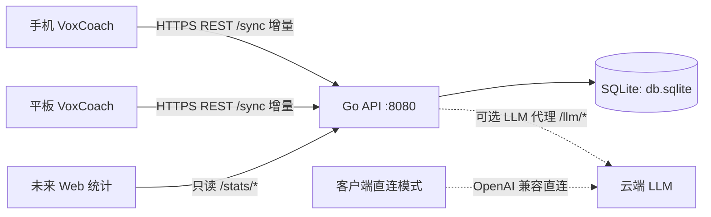

# 05 · 后端设计与 API 契约

| 项目 | 内容 |
|---|---|
| 文档版本 | v0.9.1（澄清：自有服务器仍不存音频；MiMo ASR 是厂商云，不是本后端） |
| 部署目标 | 用户自有 2 核 2G 服务器（Linux） |
| 职责边界 | 会话/评测/错题/语料/档案的**云端镜像与多设备同步**、可选的 **LLM Key 代理**、未来 Web 统计数据源 |
| 不做 | 不存录音音频、不跑任何大模型/Whisper、不做多租户 SaaS |

---

## 1. 设计原则（针对 2C2G 的取舍）

1. **薄服务**：后端只做「鉴权、存储、增量同步、透传」四件事，不承载业务智能（评分在客户端直连 LLM 完成，或走代理但不在服务端落 LLM 逻辑）。
2. **单文件持久化**：SQLite（WAL 模式）单文件，天然适合小内存备份与迁移。
3. **音频不上本后端**：会话 wav 仅本地（03 §RP）。本 2C2G 服务只收文本/结构数据。**例外（客户端直连，不经过本后端）**：按住说话的识别片段会发往用户配置的 MiMo ASR；TTS 文本发往 MiMo TTS。不要把这两件事写成「同步上传」。
4. **客户端为主（client-authoritative）**：学习内容在手机端生产，服务器是镜像 + 中继；冲突策略简单化（时间戳 LWW + 墓碑）。
5. **个人规模容量预算**：单用户多设备，日新增会话 ≤ 10，EV/错误行日增 ≤ 数百 —— 对 2C2G 完全无压力；容量约束仅来自 SQLite 文件增长与备份窗口。

---

## 2. 技术选型与理由

| 项 | 推荐 | 备选 | 理由 |
|---|---|---|---|
| 语言/框架 | **Go + chi/gin** | Node.js (NestJS/Fastify)、Python FastAPI | 单二进制、内存占用 <80MB、并发透传 SSE 优秀、无依赖安装 |
| DB | **SQLite**（`modernc.org/sqlite` 纯 Go 驱动，免 CGO） | PostgreSQL（2G 内存吃紧） | 单文件、零运维；WAL 支持并发读写 |
| 鉴权 | 每设备随机 Key（HTTP Header） | 账号密码 + JWT | 个人多设备，设备 Key 最简且可吊销 |
| 反代/TLS | Caddy（自动 HTTPS）或 Nginx | — | 统一入口 + 证书；正文纯文本数据应全链路 TLS |
| 部署 | systemd 单服务（或 Docker 可选） | — | 见 §8 |
| 备份 | 每日 SQLite 在线备份（`VACUUM INTO` / litestream） | cron 冷备 | 见 §8 |

---

## 3. 系统上下文与数据流



- **数据产生地** = 手机端（练习在端上闭环，断网可用）。服务器永远不产生学习数据（仅记录元信息）。
- **可选 LLM 代理**：仅在用户选择「Key 放服务器」模式时启用（04 §5.3 模式 B）。

---

## 4. REST API 契约（v1）

> 约定：统一前缀 `/api/v1`；响应 JSON；错误体 `{"code": string, "message": string}`；时间一律 **UTC ISO-8601**；鉴权头 `X-Device-Key`。

### 4.1 设备与鉴权

| 方法/路径 | 说明 | 请求 | 响应 |
|---|---|---|---|
| `POST /api/v1/auth/register-device` | 注册一台设备 | `{"deviceName":"Pixel8","platform":"android"}` | `{"deviceId","deviceKey","serverTime"}` |
| `POST /api/v1/auth/revoke-device` | 吊销设备 | `{deviceKey}`（需认证） | 204 |
| `GET /api/v1/health` | 存活 | — | `{"status":"ok","version"}` |

- 服务端存 Key 的 **SHA-256 哈希**（加盐）；客户端存 Key 于 Android Keystore 封装（04 §5.1）。
- 单设备换机：注册新设备 → 首次 `/sync/pull?full=1` 拉全量（个人数据量小，全量拉取完全可接受）。

### 4.2 增量同步（SY 核心）

**模型：客户端提交变更 + 服务端序列号签发。**

| 方法/路径 | 说明 |
|---|---|
| `POST /api/v1/sync/push` | 上送本地新变更（含墓碑），返回冲突裁决结果与新序列号 |
| `GET /api/v1/sync/pull?cursor=<seq>` | 拉取服务端 `seq > cursor` 的变更；`cursor=0` 或 `full=1` = 全量 |

**push 请求体（示例）**
```json
{
  "changes": [
    {
      "entity": "session", "op": "UPSERT", "id": "s_01HXY...",
      "updatedAt": "2026-09-03T08:12:30Z", "deviceId": "d_pixel",
      "data": { "type": "CONVERSATION", "topicId": "T2", "startedAt": "...", "durationMs": 421000, "turnCount": 14 }
    },
    { "entity": "session", "op": "DELETE", "id": "s_01HXY...", "updatedAt": "...", "deviceId": "d_pixel", "data": null },
    { "entity": "ev_result", "op": "UPSERT", "id": "ev_01...", "updatedAt": "...", "deviceId": "d_pixel",
      "data": { "sessionId": "s_01HXY...", "overallBand": 7.5, "dims": { "fc": 7.0, "lr": 7.5, "gra": 7.0, "p": 8.0 }, "...": "见 4.4" } }
  ]
}
```
**响应**：`{"pushed": 3, "conflicts": [], "newCursor": 9123, "serverTime": "..."}`

**pull 响应体（示例）**
```json
{ "changes": [ /* 同 push 的 change 结构 */ ], "cursor": 9123, "truncated": false }
```

**同步实体白名单**（与 04 §6.1 `dirty` 表一一对应）：

| entity | 说明 |
|---|---|
| `session` | 会话头（含 deleted 墓碑） |
| `ev_result` | 评测结果（含 dims/items 整包） |
| `mistake` | 错题本条目（状态变更 = 新版本 UPSERT） |
| `vocab_note` | 语料收藏 |
| `profile` | 学习档案单行（低频、LWW） |
| `grammar_progress` | GrammarPoint 掌握度（随 GR 更新，可低优先） |

> ⚠️ **不参与同步**：`turns` 明细与录音（体积大且为 ev_result 的输入原料；服务器只需会话统计所需的最小字段）。如需跨设备查「逐句」，v2 再议（默认不做）。

### 4.3 冲突裁决（简单、可预期）

- 主键 = `(entity, id)`；每条变更带 `updatedAt` + `deviceId`。
- 规则：**LWW**——`updatedAt` 新者胜；相等时按 `deviceId` 字典序大者胜。
- `DELETE` = 墓碑，直到被并发 UPSERT 以较新时间覆盖。
- 客户端拉取到冲突裁决后：被覆盖方本地也切换为裁决结果（即最终一致）。
- 为何不合并字段：学习数据为「快照型」，LWW 已足够且符合用户预期（不会出现错题被并发编辑的场景）。

### 4.4 EVResult 正式结构（03 §4.2 落点）

> 客户端直连评测时直接本地入库并同步 `ev_result`；经服务器代理评测时透传同结构。

```json
{
  "schemaVer": "ev.v1",
  "engine": { "model": "mimo-v2.5", "promptVer": "rubric-2026.09" },
  "overallBand": 7.5,
  "dims": {
    "fc":  { "score": 7.0, "comment": "...", "evidence": ["..."] },
    "lr":  { "score": 7.5, "comment": "...", "evidence": ["..."] },
    "gra": { "score": 7.0, "comment": "...", "evidence": ["..."] },
    "p":   { "score": 8.0, "comment": "...", "evidence": ["..."] }
  },
  "goalGap": [ { "dim": "gra", "target": 7.5, "deficit": 0.5, "suggestion": "..." } ],
  "items": [
    { "id": "i_01", "dim": "gra", "category": "grammar_tense",
      "quote": "If I know that, I will tell you yesterday.",
      "correction": "If I had known that, I would have told you yesterday.",
      "why": "与过去事实相反需用第三条件句。",
      "model": ["Had I known, I would have said so earlier."],
      "turnSeq": 6, "tRange": [128000, 15600] }
  ],
  "highlights": [ { "dim": "lr", "quote": "...", "note": "..." } ],
  "alternatives": [ { "dim": "lr", "original": "...", "better": ["...", "..."] } ],
  "createdAt": "2026-09-03T09:00:00Z"
}
```

### 4.5 统计与未来 Web（只读）

| 方法/路径 | 说明 |
|---|---|
| `GET /api/v1/stats/summary?from=&to=` | 时长/轮数/天数/次数聚合 |
| `GET /api/v1/stats/dims-trend?limit=30` | 近 N 次四维分序列 |
| `GET /api/v1/stats/weakness` | 弱项归因分布（读 mistakes + ev items） |
| `GET /api/v1/stats/export` | 全量 JSON 导出（数据所有权） |

> 服务端统计从镜像表聚合，客户端 PF 页「多设备合并视图」直接调这些端点（Web 未来复用同一套）。

---

## 5. 服务端数据模型（ER）

```mermaid
erDiagram
    DEVICE ||--o{ CHANGE_LOG : writes
    DEVICE {
        string id PK
        string name
        string key_hash
        int last_seen_at
    }
    SESSION ||--o| EV_RESULT : has
    SESSION {
        string id PK
        string device_id
        string type
        string topic_id
        int64 started_at
        int64 ended_at
        int duration_ms
        int turn_count
        bool deleted
        int64 updated_at
    }
    EV_RESULT {
        string id PK
        string session_id FK
        real overall_band
        text dims_json
        text items_json
        string prompt_ver
        int64 updated_at
    }
    MISTAKE {
        string id PK
        string device_id
        string dimension
        text quote
        text correction
        string grammar_point_id
        string status
        int64 updated_at
    }
    VOCAB_NOTE {
        string id PK
        string term
        string topic_id
        int64 updated_at
    }
    PROFILE {
        string id PK
        string stage
        int64 updated_at
    }
    CHANGE_LOG {
        int64 seq PK auto
        string device_id
        string entity
        string entity_id
        string op
        text payload_json
        int64 updated_at
    }
    DEVICE ||--o{ SESSION : creates
    DEVICE ||--o{ MISTAKE : owns
```

实现说明：
- **CHANGE_LOG = 同步主表**（append-only），`seq` 即 pull 游标；镜像业务表可重建（log 冗余 = 可重放）。
- 业务镜像表（sessions/ev_results/…）服务统计查询与 Web，不强求与客户端逐字段一致（客户端是权威数据源）。
- SQLite WAL：读（pull/stats）与写（push）并行不互斥；单写者天然避锁。

---

## 6. LLM 代理（可选，04 §5.3 模式 B）

**仅在用户选择「服务器保管 Key」时启用**，默认不部署：

| 方法/路径 | 说明 |
|---|---|
| `POST /api/v1/llm/chat` | 非流式透传（对话/GR/HINT 后端路由） |
| `POST /api/v1/llm/chat-stream` | SSE 流式透传（实时对话） |

安全边界（重点）：
1. 上游 Key 只存服务器环境变量（`LLM_UPSTREAM_KEY`），**绝不返回给客户端**；响应头不泄露。
2. **模型白名单**：`LLM_ALLOWED_MODELS` 校验 `model` 字段，防用户任意指定他模型/提权。
3. 客户端仅持 `X-Device-Key`；代理层做按设备限流（如 20 req/min）与请求体大小上限（≤64KB）。
4. 日志脱敏：不打印上游 Key、不打印对话正文（或仅调试期脱敏摘要）。
5. 透传超时与重试策略与直连模式一致（由客户端实现），代理不做业务补偿。

---

## 7. 容量与成本估算（2C2G 校验）

| 维度 | 估算 | 结论 |
|---|---|---|
| DB 年增长 | 假设 365 会话 × 5KB + EV 10KB ×2 + 错题/词条 → **≈ 20–40MB/年** | 5 年内 <200MB，SQLite 无忧 |
| 内存/CPU | Go 常驻 <80MB；LLM 代理透传峰值 ~2 并发 | 2G 内存余量充足 |
| 带宽 | 文本同步：日 ~MB 级；音频不上云 | 按量带宽几乎可忽略 |
| 备份 | 每日在线备份 + 保留 14 份 | 磁盘 <1GB |

**结论**：当前架构对 2C2G 属于「余量很大」，瓶颈只在未来若加 Web 视频/多人等场景，届时再评估升配。

---

## 8. 部署与运维（骨架，M3/M4 落地）

```yaml
# 目录布局
/opt/voxcoach/
├── voxcoach-server        # Go 单二进制
├── db.sqlite              # 数据文件
├── .env                   # 环境变量(模式B时含 LLM_UPSTREAM_KEY)
└── backups/               # 每日备份
```

- systemd 单元要点：`After=network-online.target`、`Restart=on-failure`、`EnvironmentFile=/opt/voxcoach/.env`、以非 root 用户运行。
- 反代：Caddy 一段 `reverse_proxy 127.0.0.1:8080` 自动 HTTPS；或 Nginx + certbot。
- `.env` 变量：`PORT`、`DB_PATH`、`DATA_OWNER`、`LLM_PROXY_ENABLED=false`、`LLM_UPSTREAM_*`（可选）、`LOG_LEVEL`。
- 备份：cron `每日 03:00` 执行 `sqlite3 db.sqlite ".backup backups/db-$(date).sqlite"` + 保留 14 份（或 litestream 到对象存储，P2）。
- 可观测：仅 `/health` + 进程监控 + 磁盘告警即可；不上全套可观测栈（个人场景成本最优）。

---

## 9. 接口错误码（约定）

| HTTP | code | 场景 |
|---|---|---|
| 401 | `invalid_device_key` | Key 缺失/错误/已吊销 |
| 403 | `model_not_allowed` | 代理模式请求白名单外模型 |
| 409 | `no_change` | push 内容为空（可 200 空处理） |
| 413 | `payload_too_large` | 超上限 |
| 429 | `rate_limited` | 设备限流 |
| 500 | `internal` | 未知（含 502 上游失败：`upstream_error`） |

---

*本契约与 04 §6.1 Room 表、03 §4 EVResult 三处命名严格一致；同步白名单以本章 §4.2 表为准。*
